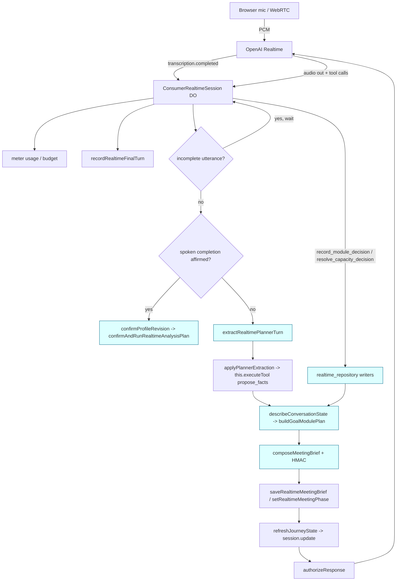
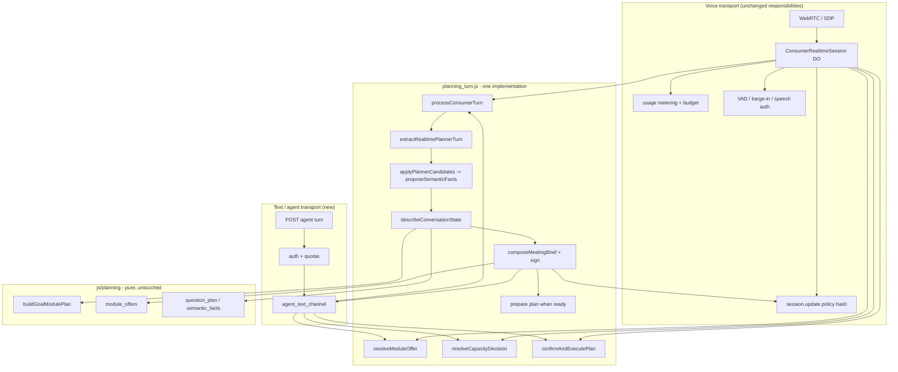
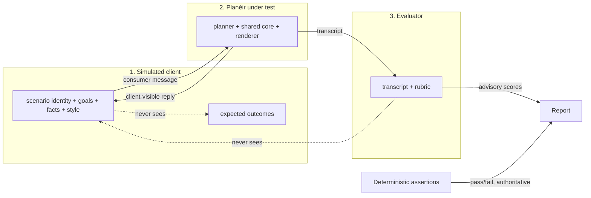
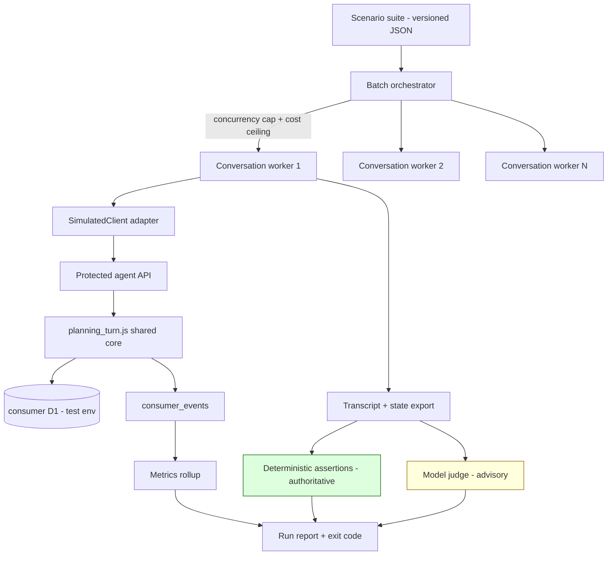

# Agent Testing Environment — Implementation Plan

> **Status update — phases A0 and A1 are delivered.**
> The architecture findings below describe the repository **as it was at commit
> `40ac8b8`, before the extraction**. Line references into
> `worker/src/consumer/realtime_session.js` are therefore historical: that file
> is now 3,188 lines and no longer contains the planning logic described in §2.
> For the current authority on what is shared, what is transport-specific and
> what is still divergent, read
> [agent-testing-parity-contract.md](agent-testing-parity-contract.md).
>
> A0/A1 also found three live defects that this plan did not anticipate, all
> registered as D-01, D-02 and D-03 in the parity contract. **D-02 is the
> significant one: the spoken module-offer and three-analysis capacity flows
> cannot currently fire in live voice at all.**
>
> Phases A2 onward remain as planned below.

**Original status:** planning only. A repository study plus a phased build
proposal for a protected text/agent transport over the *existing* consumer
planning engine.

**Scope.** A protected area of the Planéir site, and a matching machine
interface, where a human tester or an external AI model can hold a **text**
conversation with the Planéir consumer planning assistant and receive the same
planning journey, module decisions and outputs as a live realtime voice call —
with no audio, no speech and no second routing implementation.

**Governing principle.** One planning engine, multiple transports. Only audio
capture, speech generation, interruption handling and provider-specific realtime
mechanics may differ.

**Related documents.** [realtime-intelligence-implementation-plan.md](realtime-intelligence-implementation-plan.md)
(the build that produced the current v2 meeting), [goal-driven-module-orchestration-plan.md](goal-driven-module-orchestration-plan.md)
(architecture evaluation), [module-catalogue-reconciliation.md](module-catalogue-reconciliation.md)
(the manifest that owns routing), [consumer-realtime-voice-operations.md](consumer-realtime-voice-operations.md)
(operational runbook).

---

## 1. Executive summary

### What the repository already gives us

The deterministic planning core is **already transport-independent and pure**.
[`buildGoalModulePlan`](../js/planning/goal_plan.js:387) takes a profile and an
allowlist and returns goals, ranked module slots, the three-analysis capacity
state, module opportunities and the execution set. It has no knowledge of voice,
audio, HTTP or the provider. Everything the brief lists as "must be reused" —
goal ranking, fact preconditions, module eligibility, consumer-safe language,
offers, capacity replacement/deferral — lives in `js/planning/` as pure
functions.

One layer up, [`describeConversationState(profile, config)`](../worker/src/consumer/conversation.js:701)
is **already the shared seam**. It is called by the typed journey
([`processTurn`](../worker/src/consumer/conversation.js:483)), by the voice
Durable Object ([`planningContext`](../worker/src/consumer/realtime_session.js:2357))
and by the analysis preparer ([`prepareRealtimeVoiceAnalysisPlan`](../worker/src/consumer/realtime_analysis.js:15)).
That is the strongest existing parity guarantee in the codebase and the anchor
for everything below.

Two more things are better than expected:

- The **silent planner is text-in, structure-out**.
  [`extractRealtimePlannerTurn`](../worker/src/consumer/realtime_planner.js:482)
  takes a plain string (`transcript`) and returns a validated
  `PlannerExtractionV3`. It never touches audio. A typed message is a valid
  input to it today, unchanged.
- The **module and capacity decision writers are already transport-free**.
  [`recordRealtimeModuleDecision`](../worker/src/consumer/realtime_repository.js:2081)
  and [`recordRealtimeCapacityDecision`](../worker/src/consumer/realtime_repository.js:2026)
  take `(env, { sessionId, sessionRow, profile, … })` — no lease, no provider
  call id, no audio. They are misfiled in a "realtime" module but lift cleanly.

### What is actually in the way

The transport-independent *orchestration* — the sequence that turns one
finalised turn into an updated profile and a new signed meeting brief — is
trapped inside the 3,706-line Durable Object
[`realtime_session.js`](../worker/src/consumer/realtime_session.js). The worst
knot is [`applyPlannerExtraction`](../worker/src/consumer/realtime_session.js:1830),
which writes planner-extracted facts by calling
`this.executeTool('propose_facts', …)` — a **DO instance method** that also
performs provider tool-attempt accounting, evidence-item binding against
provider item ids, and realtime lease bookkeeping. Today there is no way to
write a planner-extracted fact without a Durable Object and a provider call.

Secondly, [`planningContext()`](../worker/src/consumer/realtime_session.js:2357)
hard-fails without realtime consent and a live realtime lease, and throws
`503 realtime_unavailable` when `config.realtimeEnabled` is false. Any text
transport must have a consent- and lease-free way to build the same context.

Thirdly there is **no server-side assistant-text generator**. In v2 the
assistant's actual words come from the OpenAI Realtime model speaking from the
signed brief. Text needs one new component — but it can import the existing
prompt and tool definitions verbatim rather than authoring a second prompt pack.

### The recommendation in one line

Extract a `processConsumerTurn` service from the Durable Object; make the DO the
first caller and a new protected text/agent adapter the second; re-point the
existing offline simulator at the extracted service so its current shadow
implementation is deleted rather than duplicated.

### The smallest viable first step

Not the web console. **Phase A0 + A1 + re-pointing
[`check-consumer-realtime-conversation-sim.mjs`](../scripts/check-consumer-realtime-conversation-sim.mjs)
at the extracted service** is smaller, needs no new auth surface, no new API, no
new persistence and no production behaviour change — and it immediately proves
the extraction is faithful, because that script already re-implements a slice of
the DO by hand and would start failing the moment the extraction diverged.

---

## 2. Current architecture findings

### 2.1 Layer map

| Layer | Files | Transport coupling |
|---|---|---|
| Deterministic planning core | `js/planning/*` | **None.** Pure functions of profile + config. |
| Shared conversation state | [`conversation.js:701`](../worker/src/consumer/conversation.js:701) | **None.** `(profile, config) → state`. |
| Silent planner + brief | [`realtime_planner.js`](../worker/src/consumer/realtime_planner.js) | **Near-none.** Text in; `env` only for HMAC. |
| Decision + analysis writers | [`realtime_repository.js:2026`](../worker/src/consumer/realtime_repository.js:2026), [`:2081`](../worker/src/consumer/realtime_repository.js:2081), [`realtime_analysis.js`](../worker/src/consumer/realtime_analysis.js) | **Low.** `leaseId` is an optional provenance field. |
| Turn orchestration | [`realtime_session.js`](../worker/src/consumer/realtime_session.js) | **High.** Durable Object, provider events, leases. |
| Provider session policy | [`realtime_provider.js`](../worker/src/consumer/realtime_provider.js) | **Total.** WebRTC/SDP/session.update. |
| HTTP surface | [`router.js`](../worker/src/consumer/router.js), [`index.js`](../worker/src/index.js) | n/a |

### 2.2 The v2 voice turn, step by step

This is the sequence a typed turn must reproduce. Classification in the right
column is the parity contract.

| # | Step | Code | Class |
|---|---|---|---|
| 1 | `conversation.item.input_audio_transcription.completed` | [`realtime_session.js:1017`](../worker/src/consumer/realtime_session.js:1017) | **audio** |
| 2 | Transcription usage metering, pricing-version check, dispatch-stop budget | [`:1036`](../worker/src/consumer/realtime_session.js:1036)–[`:1050`](../worker/src/consumer/realtime_session.js:1050) | **audio/cost** |
| 3 | Persist finalised turn (idempotent on provider item id) | [`:1079`](../worker/src/consumer/realtime_session.js:1079) | **shared shape, voice keying** |
| 4 | Coalesce a visibly mid-clause utterance with the next one | [`:1127`](../worker/src/consumer/realtime_session.js:1127), [`realtime_planner.js:221`](../worker/src/consumer/realtime_planner.js:221) | **speech** (ASR fragmentation) |
| 5 | Spoken-completion classification and, if affirmed, confirm + run | [`:2169`](../worker/src/consumer/realtime_session.js:2169), [`realtime_completion.js:45`](../worker/src/consumer/realtime_completion.js:45) | **classifier is speech-shaped; confirm→run is shared** |
| 6 | Silent planner extraction | [`:2114`](../worker/src/consumer/realtime_session.js:2114) → [`realtime_planner.js:482`](../worker/src/consumer/realtime_planner.js:482) | **shared** |
| 7 | Apply extraction to profile (goals, facts, positions, completions) | [`:1830`](../worker/src/consumer/realtime_session.js:1830) | **shared logic, DO-bound** |
| 8 | Re-derive plan, emit `goal_plan_evaluated` / `goal_plan_changed` | [`:1942`](../worker/src/consumer/realtime_session.js:1942)–[`:1961`](../worker/src/consumer/realtime_session.js:1961) | **shared** |
| 9 | Compose + sign `MeetingBriefV2` (incl. offer + capacity decision) | [`realtime_planner.js:880`](../worker/src/consumer/realtime_planner.js:880) | **shared** |
| 10 | If ready, prepare the analysis plan and enter `awaiting_voice_confirmation` | [`:1982`](../worker/src/consumer/realtime_session.js:1982), [`realtime_analysis.js:15`](../worker/src/consumer/realtime_analysis.js:15) | **shared** |
| 11 | Persist brief + meeting phase | [`:2030`](../worker/src/consumer/realtime_session.js:2030) | **shared** |
| 12 | Recompute provider session policy, diff, `session.update` | [`:2448`](../worker/src/consumer/realtime_session.js:2448), [`realtime_provider.js:318`](../worker/src/consumer/realtime_provider.js:318) | **provider** |
| 13 | Authorise exactly one model response | [`:1687`](../worker/src/consumer/realtime_session.js:1687) | **provider** |
| 14 | Model speaks from the signed brief; tool calls dispatched | [`:2891`](../worker/src/consumer/realtime_session.js:2891) | **provider transport; tool *handlers* are shared** |

Steps 6–11 are the whole transport-independent journey. They are ~450 lines
inside a Durable Object.

### 2.3 Mermaid — current voice flow



Blue nodes are transport-independent. Every one of them is reachable only
through the Durable Object today.

### 2.4 The existing typed journey is a seam, but not parity

`POST /api/consumer/sessions/{id}/turns` ([`router.js:1264`](../worker/src/consumer/router.js:1264))
already calls [`processTurn`](../worker/src/consumer/conversation.js:483) with a
text message and returns an assistant message. But it is the **pre-v2** journey:

- Extraction is [`extractContextBoundPatch`](../worker/src/consumer/conversation.js:344)
  (regex/rules) plus [`extractProfilePatchWithAi`](../worker/src/consumer/ai_provider.js) —
  **not** `extractRealtimePlannerTurn`.
- The assistant message is the raw question prompt verbatim
  ([`conversation.js:602`](../worker/src/consumer/conversation.js:602): *"Model
  prose is never authoritative or returned. The server owns this copy."*).
- There is **no meeting brief, no module offer, no capacity decision, no final
  confirmation and no analysis execution** in that path.
- It carries its own caller-scan question sequence
  ([`conversation.js:88`](../worker/src/consumer/conversation.js:88)) which the
  v2 meeting does not use.

The front end has already retired it. [`js/plan/app.js:246`](../js/plan/app.js:246):
*"The test planner lands on exactly one of two surfaces: the live orb meeting …
or the 'Failed to load' page. There is no typed-journey fallback."*

**Conclusion:** extending `processTurn` in its current shape would build exactly
the shadow router the brief forbids. The route and its idempotency/rate-limit
scaffolding are worth keeping; its extraction and response body must be
re-pointed at the shared service.

### 2.5 The offline simulator already shadows the Durable Object

[`check-consumer-realtime-conversation-sim.mjs`](../scripts/check-consumer-realtime-conversation-sim.mjs)
is the closest thing to the requested scenario runner, and it is genuinely
useful — but it hand-copies DO behaviour:

- [`:140`–`:164`](../scripts/check-consumer-realtime-conversation-sim.mjs:140) —
  its own fact-application loop instead of `applyPlannerExtraction`.
- [`:167`–`:198`](../scripts/check-consumer-realtime-conversation-sim.mjs:167) —
  a hand-built `context` with the comment *"Mirror the reshaping the Durable
  Object performs before it composes a brief (realtime_session.js:2346)"*.
- [`:52`–`:56`](../scripts/check-consumer-realtime-conversation-sim.mjs:52) — a
  hardcoded `FACT_GATE_APPLIES` mirroring *"realtime_session.js:2955"*.

**Both cited line numbers have already drifted.** Line 2346 is now inside
`handleSpokenCompletionTurn`; line 2955 is now `resolve_capacity_decision`; the
fact gate it describes actually lives at
[`realtime_session.js:3143`](../worker/src/consumer/realtime_session.js:3143).
The shadow is already out of date. This is the concrete cost of not having an
extracted service, and re-pointing this script is the cheapest possible proof
that the extraction is faithful.

### 2.6 Two definitions of the execution set — a real divergence

[`buildGoalModulePlan`](../js/planning/goal_plan.js:528) computes:

```js
const executionModuleIds = moduleSlots
  .filter((slot) => slot.selectionState === 'selected')
  .filter((slot) => slot.availability === 'ready' || slot.availability === 'needs_facts')
```

[`prepareRealtimeVoiceAnalysisPlan`](../worker/src/consumer/realtime_analysis.js:33)
computes, independently:

```js
const moduleIds = (planningState.moduleSlots || [])
  .filter((slot) => ['ready', 'needs_facts'].includes(slot.availability))
```

The second does **not** filter on `selectionState`. And `confirmedModuleIds` —
which is what flips `selectionState` from `accepted` to `selected`
([`goal_plan.js:469`](../js/planning/goal_plan.js:469)) — is **never written by
production code**. It is read at [`goal_plan.js:423`](../js/planning/goal_plan.js:423),
cleared at [`module_offers.js:368`](../js/planning/module_offers.js:368), and
otherwise written only by test scripts.

Net effect today: a client-accepted offer is excluded from `executionModuleIds`
forever, but *is* included in the plan that actually runs. `executionModuleIds`
is currently dead in the voice path. This is not necessarily a behavioural bug —
the prepared plan is arguably the correct set — but it is **two implementations
of "which modules execute"**, and a parity contract cannot be written until one
is chosen. Resolving it is a Phase A0 deliverable, not something to discover
mid-build.

### 2.7 Authentication, persistence and deployment as they stand

**Adviser/admin auth (exists, reusable).**
[`requireAdvisorSession`](../worker/src/index.js:4973) — `planeir_advisor_session`
HttpOnly cookie ([`index.js:34`](../worker/src/index.js:34)), PBKDF2 password,
7-day TTL, `X-Advisor-CSRF` double-submit ([`:5019`](../worker/src/index.js:5019)),
trusted-origin check, in-memory *and* persistent per-IP rate limits. Twenty-plus
adviser endpoints already use it.

**Consumer session auth (exists).** [`requireConsumerSession`](../worker/src/consumer/session_auth.js:6)
— `X-Consumer-Session: cs_<id>.<secret>`, SHA-256 constant-time compare,
expiry-driven hard delete.

**Machine/service auth — does not exist.** There is no service token, no API key
scope, no non-interactive credential. This is the one genuine auth gap for agent
runners.

**Session minting is already automated.**
[`run-consumer-realtime-conversation-probe.mjs:119`](../scripts/run-consumer-realtime-conversation-probe.mjs:119)
does advisor login → `POST /api/advisor/consumer-invite` → `GET /api/consumer/bootstrap`
→ `POST /api/consumer/sessions` → realtime consent. The agent runner can reuse
this verbatim.

**Persistence.** `consumer_sessions` carries a `feature_cohort` column
([`0001_create_consumer_journey.sql`](../worker/consumer-migrations/0001_create_consumer_journey.sql)),
already fed by `CONSUMER_COHORT` ([`config.js:273`](../worker/src/consumer/config.js:273)).
Profiles are encrypted per revision; briefs live in `realtime_meeting_briefs`
(migration 0011); planner usage in `realtime_planner_usage` (0012). Analytics
events go through an **allowlist**: [`ALLOWED_EVENT_NAMES`](../worker/src/consumer/repository.js:24)
and per-event metadata allowlists, dropped silently if unknown
([`:1997`](../worker/src/consumer/repository.js:1997)).

**A separate test environment already exists.**
[`wrangler.consumer-test.toml`](../worker/wrangler.consumer-test.toml) — its own
D1 (`planeir-consumer-test`), `CONSUMER_COHORT = "automated_test"`, realtime
off. Production `CONSUMER_DB` is not even committed; it is appended to an
ephemeral config at deploy time ([`wrangler.toml:18`](../worker/wrangler.toml)).

**Static site.** [`scripts/build-pages.mjs`](../scripts/build-pages.mjs) has an
explicit `HTML_FILES` allowlist. `dev/success-takeover-preview.html` is **not**
in it — an existing precedent for a local-only developer page that never ships.

### 2.8 The ten questions, answered

1. **Is there a typed journey that can be the foundation?** Yes —
   `processTurn` + `POST …/turns` — but only its *shell* (idempotency, rate
   limits, turn persistence). Its extraction and response are pre-v2 and must be
   re-pointed, not extended.
2. **Does the realtime session own too much transport-independent behaviour?**
   Yes. Steps 6–11 of §2.2, ~450 lines, plus the `propose_facts` fact-write
   gate.
3. **Is there an existing turn-processing primitive that accepts text?** Two
   halves, neither complete: `processTurn` (text in, but wrong pipeline) and
   `processPlannerTurn` (right pipeline, but a DO method keyed on provider item
   ids). The extraction fuses them.
4. **Which voice tools become shared planning commands?**
   `record_module_decision`, `resolve_capacity_decision`, `get_intake_explanation`,
   `get_meeting_brief`, `confirm_and_run_voice_plan`, plus the internal
   `propose_facts` path. All of [`REALTIME_V2_TOOL_DEFINITIONS`](../worker/src/consumer/realtime_provider.js:119)
   except `wait_for_user`.
5. **Which pieces stay voice-only?** SDP/WebRTC, `session.update` policy hashing,
   VAD/turn detection, barge-in and cancelled-speech recovery, transcription and
   audio-token metering, `wait_for_user`, `issueRealtimeSpeechAuthorization`,
   `isLikelyIncompleteRealtimeUtterance`, and the outro/hang-up sequence.
6. **Can the simulator be upgraded to use the production session layer?** Yes,
   and it should be — see §2.5. It is the acceptance test for Phase A1.
7. **Where should test sessions live?** Same tables, `feature_cohort` marker,
   in the **separate test environment** for the MVP. See §9.
8. **What auth exists?** Adviser cookie+CSRF (rich), consumer session credential
   (rich), machine tokens (none).
9. **What UI shell hosts the console?** MVP: a local-only `dev/` page. Near
   term: a new `app/agent-console.html` inside the existing adviser portal,
   behind `requireAdvisorSession`. See §10.
10. **What is needed for safe model-driven batch tests?** Machine auth, a run
    grouping table, per-run concurrency and cost ceilings, a model allowlist,
    synthetic-only enforcement, and a hard separation between the simulated
    client and the judge. See §8 and §12.

---

## 3. Exact reusable production seams

Every item below was read in this checkout. "Reuse as-is" means no signature
change is required.

### 3.1 Reuse as-is (zero change)

| Seam | Location | Why it is safe |
|---|---|---|
| `buildGoalModulePlan` | [goal_plan.js:387](../js/planning/goal_plan.js:387) | Pure `(profile, {allowedModuleIds, adviserOverrides})`. Owns ranking, `MAX_CONSUMER_ANALYSES = 3` ([:224](../js/planning/goal_plan.js:224)), capacity, opportunities, `withheldOpportunities` (never serialised). |
| `describeConversationState` | [conversation.js:701](../worker/src/consumer/conversation.js:701) | Already the three-caller shared seam. |
| `buildQuestionPlan` / `stageFromQuestionPlan` | [question_plan.js:63](../worker/src/consumer/question_plan.js:63) | Pure; wraps the canonical planner and applies acknowledged-missing suppression. |
| `consumerLanguageForModule`, `nextModuleOffer`, `composeModuleOffer`, `composeCapacityChoice`, `applyModuleReplacement`, `applyModuleDeferral`, `confirmationSummary`, `containsInternalModuleTerminology` | [module_offers.js](../js/planning/module_offers.js) | Pure. The single translation from module id to client-safe language ([:81](../js/planning/module_offers.js:81)). |
| `extractRealtimePlannerTurn` | [realtime_planner.js:482](../worker/src/consumer/realtime_planner.js:482) | `transcript` is a plain string. A typed message is already a valid input. |
| `plannerContextSlice` | [realtime_planner.js:449](../worker/src/consumer/realtime_planner.js:449) | Pure projection of context for the planner prompt. |
| `positionCandidatesToRealtimeFacts`, `sectionCompletionToRealtimeFact`, `withSafeTurnClassifications` | [realtime_planner.js:638](../worker/src/consumer/realtime_planner.js:638), [:710](../worker/src/consumer/realtime_planner.js:710), [:383](../worker/src/consumer/realtime_planner.js:383) | Pure mappers. |
| `composeMeetingBrief`, `toConsumerMeetingBrief`, `toConversationGuide`, `intakeExplanation` | [realtime_planner.js:880](../worker/src/consumer/realtime_planner.js:880), [:1052](../worker/src/consumer/realtime_planner.js:1052), [:1217](../worker/src/consumer/realtime_planner.js:1217), [:1266](../worker/src/consumer/realtime_planner.js:1266) | `env` used only for the HMAC signature. |
| `recordRealtimeModuleDecision`, `recordRealtimeCapacityDecision` | [realtime_repository.js:2081](../worker/src/consumer/realtime_repository.js:2081), [:2026](../worker/src/consumer/realtime_repository.js:2026) | No lease, no provider. Revisioned profile write reusing the shared offer helpers. |
| `prepareRealtimeVoiceAnalysisPlan`, `confirmAndRunRealtimeAnalysisPlan`, `buildGatedModuleDisclosure` | [realtime_analysis.js:15](../worker/src/consumer/realtime_analysis.js:15), [:121](../worker/src/consumer/realtime_analysis.js:121), [:80](../worker/src/consumer/realtime_analysis.js:80) | `leaseId` is provenance only; `recordRealtimeRunProvenance` is already conditional ([:193](../worker/src/consumer/realtime_analysis.js:193)). |
| `buildVoiceConfirmationSummary` | [realtime_completion.js:73](../worker/src/consumer/realtime_completion.js:73) | Pure text composition from brief fields. |
| `REALTIME_V2_TOOL_DEFINITIONS`, `realtimeToolsForState`, `buildRealtimeConversationV2Instructions` | [realtime_provider.js:119](../worker/src/consumer/realtime_provider.js:119), [:292](../worker/src/consumer/realtime_provider.js:292), [:261](../worker/src/consumer/realtime_provider.js:261) | Depend only on `state` and `config`. Importable by a text transport — **this is what prevents a second prompt pack**. |
| `mapRealtimeFact`, `realtimeFactValueVocabulary`, `buildConfirmedRealtimeFactSummary` | [realtime_fact_mapper.js:1110](../worker/src/consumer/realtime_fact_mapper.js:1110), [:81](../worker/src/consumer/realtime_fact_mapper.js:81), [:1400](../worker/src/consumer/realtime_fact_mapper.js:1400) | Pure. |
| `applyProfilePatch`, `redactSensitiveIdentifiers` | [validators.js](../worker/src/consumer/validators.js) | Pure. |
| `requireAdvisorSession` | [index.js:4973](../worker/src/index.js:4973) | Origin + CSRF + dual rate limits, already in production use. |
| Session-minting flow | [probe:119](../scripts/run-consumer-realtime-conversation-probe.mjs:119) | Reusable end-to-end. |

### 3.2 Reuse with a small, additive signature change

| Seam | Change | Risk |
|---|---|---|
| `runStoredConsumerAnalysis` | none — already `(env, config, sessionRow, profile, moduleIds, scenarioOverrides)` | none |
| `recordRealtimeFinalTurn` | accept a `channel` discriminator alongside `providerItemId` so a text turn id is not mistaken for a provider id | low; additive column + default |
| `recordEvent` | extend [`ALLOWED_EVENT_NAMES`](../worker/src/consumer/repository.js:24) and `EVENT_METADATA_FIELDS` with the new planning events | low; unknown names are currently dropped silently, so nothing breaks — but nothing records either |

### 3.3 Must be extracted (the actual work)

| Behaviour | Currently | Target |
|---|---|---|
| Build planning context without realtime consent/lease | [`planningContext`](../worker/src/consumer/realtime_session.js:2357) (DO method, hard-requires both) | `buildPlanningContext({ env, config, sessionRow, profile, meetingBrief, phase })` in a new module |
| Write planner-extracted facts | `applyPlannerExtraction` → `this.executeTool('propose_facts', …)` ([:1898](../worker/src/consumer/realtime_session.js:1898)) | `applyPlannerCandidates({ env, config, sessionRow, profile, extraction, evidenceRef })` |
| The `propose_facts` validation body | inline in `executeTool` ([:3110](../worker/src/consumer/realtime_session.js:3110)–[:3174](../worker/src/consumer/realtime_session.js:3174)) | `proposeSemanticFacts(...)` — pure validation + revisioned write |
| Turn → extraction → brief → phase | [`processPlannerTurn`](../worker/src/consumer/realtime_session.js:2114) + [`applyPlannerExtraction`](../worker/src/consumer/realtime_session.js:1830) tail | `processConsumerTurn(...)` |
| Offer / capacity decision dispatch | `executeTool` branches ([:2903](../worker/src/consumer/realtime_session.js:2903), [:2954](../worker/src/consumer/realtime_session.js:2954)) | `resolveModuleOffer(...)` / `resolveCapacityDecision(...)`, called by both transports |
| Confirm → run | [`handleSpokenCompletionTurn`](../worker/src/consumer/realtime_session.js:2169) | `confirmAndExecutePlan(...)`, with the spoken classifier as an injected pre-filter |

---

## 4. Gaps and risks

### 4.1 Gaps in current capability

| # | Gap | Consequence for this project |
|---|---|---|
| G1 | No server-side assistant-text renderer | Text needs one new component (§5.4). It is the only genuinely new prompt-facing code. |
| G2 | Fact writes require a Durable Object | The highest-risk extraction. Cannot be avoided. |
| G3 | `planningContext` requires realtime consent + lease | Text sessions would need to fake a realtime lease unless extracted. |
| G4 | `confirmedModuleIds` never written; two execution-set definitions (§2.6) | The parity contract cannot be authored until this is settled. |
| G5 | No machine/service auth | Agent runners must either drive the adviser cookie flow (fragile, interactive) or a new scoped token is required. |
| G6 | `consumer_events` is allowlisted and metadata-stripped | New planning events are silently dropped today. Observability needs a repository change. |
| G7 | No test-run grouping entity | Batch mode has nowhere to hang `runId`/`scenarioId`/versions. |
| G8 | Analysis-run provenance assumes a realtime lease | `recordRealtimeRunProvenance` is lease-keyed; already conditional, but text runs would have no provenance row. |
| G9 | Adviser portal pages are static, served from GitHub Pages, calling a cross-origin Worker | The console is a static page + `fetch`, with the existing `SameSite=None` cookie ([`index.js:845`](../worker/src/index.js:845)). Fine, but CORS/CSRF must be explicit. |

### 4.2 Risks

| # | Risk | Severity | Mitigation |
|---|---|---|---|
| R1 | Extraction silently changes live voice behaviour | **High** | DO becomes a *caller*, not a rewrite. `check:consumer-realtime` (5,099 lines) must pass unchanged at every phase. Phase A0 adds a characterisation test *before* moving any code. |
| R2 | The text renderer drifts into a second prompt pack | **High** | Hard rule: text imports `buildRealtimeConversationV2Instructions` and `realtimeToolsForState`. A check script asserts no second instruction array exists. |
| R3 | A shadow question planner appears in the console | **High** | The console renders `toConsumerMeetingBrief` output only. It never composes a question. |
| R4 | Test sessions pollute production analytics/cost | **Medium** | Separate test env for MVP; `feature_cohort` filter on every analytics read; separate budget envelope. |
| R5 | The agent endpoint becomes an unauthenticated inference proxy | **High** | See §8. Never public; never model-choice-by-request; hard turn and cost caps. |
| R6 | Deterministic action mode is used for parity assertions | **Medium** | Responses carry `decisionMode: "utterance" \| "action"`. Parity fixtures reject `action`. |
| R7 | LLM-judge scores substitute for safety assertions | **Medium** | Judge output is advisory metadata only; the runner's exit code depends solely on deterministic assertions. |
| R8 | Real client data reaches test transcripts | **Medium** | Synthetic-only by default, enforced at scenario load; `redactSensitiveIdentifiers` already applied on the turn path. |
| R9 | Planner cost explosion in batch mode | **Medium** | Every turn is one planner call plus one renderer call. Per-run token/euro ceiling, enforced before dispatch, not after. |
| R10 | Voice canary destabilised mid-work | **High** | Every phase is independently deployable and voice-behaviour-neutral until A8. Feature flag `CONSUMER_AGENT_TEST_ENABLED` defaults false. |

---

## 5. Recommended architecture

### 5.1 Shape

Three new Worker modules plus one new transport adapter. No new planning logic.

```
worker/src/consumer/
  planning_context.js     NEW  buildPlanningContext (consent/lease-free)
  planning_turn.js        NEW  processConsumerTurn, resolveModuleOffer,
                               resolveCapacityDecision, confirmAndExecutePlan,
                               applyPlannerCandidates, proposeSemanticFacts
  agent_text_channel.js   NEW  renderAssistantText (text transport adapter)
  realtime_session.js     EDIT becomes a caller of the above
  router.js               EDIT mounts the protected agent routes
```

### 5.2 Mermaid — proposed shared-core flow



### 5.3 The turn primitive

Evaluated against the brief's suggested shape and adjusted to repository
reality. Names below are proposals, not existing symbols.

```
processConsumerTurn({
  env,
  config,
  sessionRow,             // already the unit of identity everywhere
  profile,
  channel,                // 'voice' | 'text' | 'agent_test'
  actor,                  // 'consumer'
  message,                // plain text, already redacted by the caller
  turnRef,                // provider item id (voice) | server turn id (text)
  expectedRevision,       // optional optimistic-concurrency guard
  recentTurns,            // for planner context
  meetingBrief            // the currently active signed brief
})
```

Returns:

```
{
  revision,               // profile revision after the turn
  turnId,
  brief,                  // signed MeetingBriefV2 (internal form)
  outcomes,               // per-candidate accept/reject with error codes
  phase,                  // realtime meeting phase
  analysisPlan,           // when prepared
  execution,              // when confirm+run happened this turn
  stale                   // ordinal guard, mirrors current DO semantics
}
```

**Deliberate departures from the brief's sketch:**

- No `assistantMessage` in the core return. The core does not speak. Voice's
  words come from the Realtime model; text's come from the transport adapter.
  Putting `assistantMessage` in the core would either force the core to make a
  provider call (breaking the DO's latency model) or force voice to discard it.
- No `pendingQuestion` / `activeModuleOffer` / `activeCapacityDecision` as
  separate fields. They are **already** fields of `MeetingBriefV2`
  (`questionBatch`, `moduleOffer`, `capacityDecision`). Duplicating them creates
  two sources of truth.
- No `debugState`. Diagnostics are a separate, explicitly filtered projection
  (§5.5) — never a field of the production turn result.
- `sessionId` replaced by `sessionRow` because every downstream writer already
  needs the row for its optimistic-concurrency `WHERE current_profile_revision = ?`.

### 5.4 The one new component: the text speaker

```
renderAssistantText({ env, config, state, brief, recentTurns })
  → { text, toolCalls, usage }
```

Implementation constraints, all of which are what keeps this from becoming a
second chatbot:

1. Instructions come from `buildRealtimeConversationV2Instructions(state)` —
   **imported, not re-authored**.
2. Tools come from `realtimeToolsForState(state)` — the same gating that already
   hides `record_module_decision` unless an offer is live
   ([`realtime_provider.js:298`](../worker/src/consumer/realtime_provider.js:298))
   and `resolve_capacity_decision` unless a capacity decision is live ([:301](../worker/src/consumer/realtime_provider.js:301)).
3. `wait_for_user` is filtered out for text (a text turn always needs a reply).
4. Tool calls are dispatched to the **same** shared handlers voice uses.
5. Output passes `containsInternalModuleTerminology` before it leaves the server.
6. Transport: OpenAI Responses API, `store: false`, matching the existing
   planner/director calls. Model from `config.defaultModel`.

[`composeDirectedSpeech`](../worker/src/consumer/realtime_director.js:81) is the
precedent for how to wrap a text speaker safely (bounded output, JSON schema,
fail-open to a deterministic template, never authoritative). It is disabled
under v2 ([`config.js:350`](../worker/src/consumer/config.js:350)) and its inputs
are v1-shaped, so it is a **pattern to copy, not code to reuse**.

**Fallback.** If the renderer fails or times out, fall back to
`brief.questionBatch.prompt` — the deterministic server-owned question. A text
session must never stall on a renderer failure.

### 5.5 Three visibility tiers

Enforced by three distinct projection functions. This is the answer to
"distinguish public consumer response / tester diagnostics / internal state".

| Tier | Contents | Function | Who sees it |
|---|---|---|---|
| **Public consumer** | `assistantText`, `turnId`, `revision`, `phase`, `consumerResults` | `toAgentConsumerView(...)` — built on [`toConsumerMeetingBrief`](../worker/src/consumer/realtime_planner.js:1052) | The external model. The console's "what the client sees" panel. |
| **Tester diagnostic** | goals, facts + certainty + status, `stillNeeded`, module slots with ids, offer/capacity state, capacity counters, `analysisPlan`, candidate outcomes with error codes, planner latency/tokens | `toAgentDiagnosticView(...)` — new, explicit allowlist | Authenticated tester only. |
| **Internal only** | `withheldOpportunities` ([`goal_plan.js:578`](../js/planning/goal_plan.js:578)), brief `signature`, plan nonce, encryption material, raw planner prompt, provider ids, credential hashes | never projected | Server only. |

`withheldOpportunities` is the sharpest line: the source comment is *"NEVER
serialise this to a consumer surface"*. It must not reach the external model
either, since the model is playing the consumer. It **may** reach the tester
diagnostic view — that is precisely the kind of thing a tester needs to see —
but only behind adviser auth and never in the same payload the model receives.

---

## 6. Request/response lifecycle

### 6.1 A text turn, end to end

```mermaid
sequenceDiagram
    participant R as Test runner or console
    participant W as Worker agent routes
    participant C as planning_turn.js
    participant P as Responses API
    participant S as agent_text_channel
    participant D as D1

    R->>W: POST /api/consumer/agent-tests/{id}/turns {message, expectedRevision}
    W->>W: adviser session OR service token; quotas; turn cap
    W->>D: load sessionRow + profile (decrypt)
    W->>C: processConsumerTurn({channel:'agent_test', message, ...})
    C->>D: recordFinalTurn(role:'user')
    C->>P: extractRealtimePlannerTurn(transcript=message)
    P-->>C: PlannerExtractionV3
    C->>C: applyPlannerCandidates -> proposeSemanticFacts (per candidate)
    C->>D: revisioned profile writes
    C->>C: describeConversationState -> buildGoalModulePlan
    C->>C: composeMeetingBrief + HMAC
    C->>D: saveMeetingBrief / setMeetingPhase
    alt brief.readyToConfirm
      C->>C: prepareRealtimeVoiceAnalysisPlan
    end
    C-->>W: {revision, brief, outcomes, phase}
    W->>S: renderAssistantText(state, brief, recentTurns)
    S->>P: Responses API (v2 instructions + v2 tools)
    P-->>S: text + optional tool call
    alt tool call
      S->>C: resolveModuleOffer / resolveCapacityDecision / confirmAndExecutePlan
      C-->>S: decision result + acknowledgement
      S->>P: second pass with tool output
    end
    S->>D: recordFinalTurn(role:'assistant')
    S-->>W: assistantText + usage
    W-->>R: {consumer: {...}, diagnostics: {...}, usage: {...}}
```

### 6.2 Concurrency and revision handling

Voice serialises turns through the Durable Object's single-threaded execution
plus a planner ordinal guard ([`realtime_session.js:1968`](../worker/src/consumer/realtime_session.js:1968)).
Text has no DO. Two options:

- **Recommended for MVP:** optimistic concurrency on `expectedRevision`, mirroring
  the existing `profile_revision_conflict` semantics used throughout
  ([`router.js:1273`](../worker/src/consumer/router.js:1273),
  [`realtime_session.js:2867`](../worker/src/consumer/realtime_session.js:2867)).
  A test session has exactly one driver, so contention is a bug signal, not a
  normal case. Return `409 profile_revision_conflict` and let the runner refetch.
- **Deferred:** route agent sessions through a Durable Object too. Only needed if
  concurrent multi-driver sessions become a requirement. Adds a DO migration.

### 6.3 Deterministic action mode

Both modes exist and are explicitly separated. This is a recommendation, not a
settled decision (§18, D6).

| Mode | How a decision is made | Parity-eligible |
|---|---|---|
| **Utterance** (default) | The runner sends `"yes, that would be useful"`. The renderer's model calls `record_module_decision` exactly as voice does. | **Yes** |
| **Action** | The runner sends `{action: "resolveOffer", decision: "accepted"}`. The server resolves the *server-owned* active offer directly — it still cannot name a module. | **No** |

Action mode exists so a test that needs to reach the three-analysis capacity
flow does not have to gamble on classifier behaviour four turns earlier. Its
constraints are the same as the tool's: the server owns which offer is on the
table; `replaceChoiceIndex` indexes a server-owned list, never a module id;
`uncertain`/`unclear` mutate nothing. Every response carries
`decisionMode: "utterance" | "action"`, and parity fixtures (§7) reject any
transcript containing an `action` turn.

---

## 7. Voice/text parity model

### 7.1 The parity contract (Phase A0 deliverable)

A committed document plus a machine-checkable manifest, written **before** any
code moves, listing every behaviour and its class:

| Class | Meaning | Test obligation |
|---|---|---|
| `shared` | Must be byte-identical across transports | Parity fixture asserts equality |
| `transport` | Legitimately differs | Isolated test per transport; excluded from parity |
| `divergent` | Differs today and should not | Listed with an owner and a resolution phase |

Initial `divergent` entries, from §2.6 and §2.4:

- `executionModuleIds` vs the prepared-plan module list (G4).
- The typed `/turns` route's extraction pipeline vs the planner pipeline.
- `realtimeFactAllowed` gating, which is disabled under v2
  ([`realtime_session.js:3143`](../worker/src/consumer/realtime_session.js:3143))
  but still shapes the simulator's expectations.

### 7.2 What must be identical

Given semantically equivalent turns, both transports must produce identical:

1. `profile.goals` (types, priorities, statuses, order)
2. accumulated semantic facts (ids, canonical values, certainty, status)
3. `goalAssessment` (primary, active, deferred, confidence)
4. `moduleSlots` (ids, slot order, source, `selectionState`, availability)
5. `moduleOpportunities` (ids and states) and the emptiness of the consumer view
   of `withheldOpportunities`
6. `capacity` (`used`, `atLimit`, `overflowModuleIds`, `replaceableModuleIds`)
7. `brief.questionBatch.primaryFact.factId` and `brief.stillNeeded` ordering
8. `brief.moduleOffer.moduleId` and `brief.capacityDecision.candidateModuleId`
9. `analysisPlan.moduleIds` and the executed module id set
10. `confirmationSummary` text
11. the consumer-language guard: no internal terminology in any client-facing field

### 7.3 What cannot be identical

| Behaviour | Why | How it is tested instead |
|---|---|---|
| Turn segmentation | Semantic VAD splits speech; text arrives whole | `isLikelyIncompleteRealtimeUtterance` unit tests (voice only) |
| Transcription errors | No ASR in text | Voice-only fixtures with corrupted transcripts |
| Barge-in / interruption | No concurrent stream in text | Existing DO tests |
| Filler and latency masking | No perceived latency in text | Voice-only |
| Assistant wording | Two different model calls | Assert *structure and constraints*, never string equality |
| Usage/cost accounting | Audio tokens vs text tokens | Separate metering assertions |
| `wait_for_user` | Meaningless in text | Voice-only tool test |

Point 5 is the one to be honest about: **wording parity is not achievable and
should not be claimed.** Parity is asserted on planning state, not prose.

### 7.4 Mirrored fixtures

Extend [`consumer-realtime-scenarios.json`](../scripts/fixtures/consumer-realtime-scenarios.json)
with a `parity` block per scenario:

```jsonc
{
  "id": "young_renter_first_home",
  "turns": [ /* existing scripted extractions, voice */ ],
  "parity": {
    "textTurns": ["I'm 25, renting, and trying to buy my first place"],
    "assertIdentical": ["goals","facts","moduleSlots","capacity","stillNeeded"]
  }
}
```

A new `check:consumer-transport-parity` runs each scenario through both
transports with the planner stubbed by the recorded extraction (so parity is
tested deterministically, with no API key and no network) and diffs the eleven
fields in §7.2.

Where the planner itself is under test — whether the *model* emits the right
facts from a typed message — that is a paid probe, not a parity test, and stays
in the same tier as [`run-consumer-realtime-conversation-probe.mjs`](../scripts/run-consumer-realtime-conversation-probe.mjs).

---

## 8. Authentication and safety

### 8.1 Access model

| Actor | Credential | Recommendation |
|---|---|---|
| Human tester (console page) | Existing adviser cookie + `X-Advisor-CSRF` | **Reuse `requireAdvisorSession`.** No new auth for the MVP. |
| Local developer | none (local wrangler only) | MVP console is a local-only `dev/` page. |
| CI scenario runner | Adviser password secret, already in CI as `ADVISOR_SMOKE_PASSWORD` | Reuse the probe's minting flow. |
| External agent runner (batch) | **New scoped service token** | Phase A5+. Bearer token, single scope `agent_test`, per-token quotas, rotatable, never in the browser. |
| Adviser firms running their own tests | — | **Out of scope.** See §18 D5. |

### 8.2 Controls

| Control | Value / mechanism |
|---|---|
| Feature flag | `CONSUMER_AGENT_TEST_ENABLED`, default `false`, validated in [`getConsumerConfig`](../worker/src/consumer/config.js:86) alongside the other gates |
| Environment gate | Refuse to enable when `CONSUMER_COHORT` is not a test cohort, unless an explicit second flag is set |
| Origin | Existing trusted-origin check in `requireAdvisorSession`; `ALLOWED_ORIGINS` already pinned in wrangler |
| CSRF | Existing `X-Advisor-CSRF` double-submit for cookie-auth calls. Service-token calls are exempt (no ambient credential) and must reject cookies. |
| Rate limit — session creation | reuse `checkPersistentRateLimit`; ~10/hour/IP for MVP |
| Rate limit — turns | reuse the existing per-session limiter pattern (`rateLimit(env, 'consumer-turn-session', …)`, [`router.js:1265`](../worker/src/consumer/router.js:1265)) |
| Max turns | reuse `config.maxTurnsPerSession` ([`config.js:282`](../worker/src/consumer/config.js:282), default 80, hard max 200) |
| Max message length | reuse `config.maxMessageLength` (default 4,000, hard max 12,000) |
| Request body size | reuse `MAX_REQUEST_BODY_BYTES` in [`router.js`](../worker/src/consumer/router.js:262) |
| Per-run cost ceiling | new: euro-micro budget per test run, checked **before** each dispatch, mirroring the realtime dispatch-stop pattern |
| Concurrency | MVP: 1 conversation at a time. A4: ≤3. A6: ≤10, configurable, hard-capped in code. |
| Model allowlist | Server-side only. The request may name a *role* (`planner`, `renderer`, `client`, `judge`), never a model id. |
| Personal data | `redactSensitiveIdentifiers` already runs on the turn path. Scenario loader rejects anything matching PPS/IBAN/card patterns. |
| Synthetic-only | Enforced by default. A scenario file must carry `"synthetic": true` to load. |
| Audit logging | Every session create / turn / decision / execution / export writes a `consumer_events` row with the run and scenario ids |
| Retention | MVP: test sessions inherit `CONSUMER_SESSION_TTL_DAYS` and the existing expiry sweep ([`cleanupExpiredConsumerSessionsWithRealtime`](../worker/src/consumer/router.js:527)) |

### 8.3 What the external model may never do

Enforced structurally, not by prompt:

| Prohibited | Structural enforcement |
|---|---|
| Submit module ids | The API accepts no module id on any consumer-facing route. `record_module_decision` has no module parameter ([`realtime_provider.js:143`](../worker/src/consumer/realtime_provider.js:143)); `resolve_capacity_decision` takes an *index* into a server-owned list ([:167](../worker/src/consumer/realtime_provider.js:167)). |
| Alter profile facts directly | No patch route in the agent API. Facts only via planner extraction from natural language. |
| Select execution modules | `analysisPlan.moduleIds` derives from `moduleSlots`; there is no input path. |
| Bypass offers | Offers are generated by `nextModuleOffer` from `moduleOpportunities`. |
| Bypass final confirmation | The plan nonce + `confirmed_profile_revision` check in [`confirmAndRunRealtimeAnalysisPlan`](../worker/src/consumer/realtime_analysis.js:146) is unchanged. |
| Call internal planning tools | The agent transport exposes *messages*, not tools. Only the server-side renderer holds tools. |
| See hidden modules | `withheldOpportunities` never enters the consumer projection. |
| Mutate another session | Session id is bound to the credential; the same `requireConsumerSession` id-match pattern applies. |

---

## 9. Data model and persistence

### 9.1 Recommendation

**MVP: same tables, `feature_cohort` marker, separate test environment.**

Rationale, in order:

1. Parity *is* the product. Test sessions must exercise the same encryption,
   revisioning, optimistic concurrency and expiry as production. A separate
   schema would test a different system.
2. `feature_cohort` already exists on `consumer_sessions` and is already fed
   from config. No migration is needed to mark a test session.
3. [`wrangler.consumer-test.toml`](../worker/wrangler.consumer-test.toml)
   already provisions an isolated D1 with `CONSUMER_COHORT = "automated_test"`.
   Pollution is addressed by *environment*, not by schema.
4. Production `CONSUMER_DB` is not committed and is bound only at deploy time,
   so the blast radius of a misconfiguration is already small.

**Do not** use ephemeral in-memory storage. It would bypass the revision and
encryption paths, which are exactly what an agent test should be exercising.

### 9.2 New tables (Phase A4+, not MVP)

```sql
-- 00NN_add_agent_test_runs.sql  (additive; consumer-migrations)
CREATE TABLE IF NOT EXISTS consumer_agent_test_runs (
  id TEXT PRIMARY KEY,
  scenario_id TEXT NOT NULL,
  scenario_version TEXT NOT NULL,
  suite_id TEXT,
  status TEXT NOT NULL CHECK (status IN ('running','passed','failed','error','cancelled')),
  channel TEXT NOT NULL DEFAULT 'agent_test',
  client_adapter TEXT NOT NULL,          -- 'scripted' | 'openai' | 'anthropic'
  planner_prompt_version TEXT NOT NULL,
  renderer_prompt_version TEXT NOT NULL,
  module_manifest_version TEXT NOT NULL,
  selection_policy_version TEXT NOT NULL,
  turn_count INTEGER NOT NULL DEFAULT 0,
  cost_micro_eur INTEGER NOT NULL DEFAULT 0,
  started_at TEXT NOT NULL,
  finished_at TEXT
);

CREATE TABLE IF NOT EXISTS consumer_agent_test_sessions (
  run_id TEXT NOT NULL,
  session_id TEXT NOT NULL,
  PRIMARY KEY (run_id, session_id)
);

CREATE TABLE IF NOT EXISTS consumer_agent_test_assertions (
  id TEXT PRIMARY KEY,
  run_id TEXT NOT NULL,
  kind TEXT NOT NULL,                    -- must_ask | must_never_ask | must_select | ...
  target TEXT NOT NULL,
  passed INTEGER NOT NULL CHECK (passed IN (0,1)),
  detail TEXT,
  created_at TEXT NOT NULL
);
```

Version columns are deliberate: a result is not reproducible unless the manifest,
policy and prompt versions that produced it are recorded alongside it.
`getPlanningPlaybookManifestVersion` and `GOAL_ROUTING_POLICY_VERSION` are already
surfaced by [`buildGoalModulePlan`](../js/planning/goal_plan.js:563).

### 9.3 Evolution

| Stage | Persistence |
|---|---|
| MVP (A1–A3) | Test env D1, existing tables, `feature_cohort='agent_test'` |
| A4–A5 | + `consumer_agent_test_runs` / `_sessions` / `_assertions` |
| A6–A7 | + transcript export to R2 (`SESSIONS_BUCKET` pattern already exists); metrics rollups |
| Scale | Agent-test analytics into `services/learning-signals` as a separate tenant — it already has tenant isolation, retention, erasure and metric views |

---

## 10. Website console design

### 10.1 Where it should live

| Option | Verdict |
|---|---|
| Existing adviser portal (`app/*.html`) | **Recommended for the first shipped version.** `requireAdvisorSession` + CSRF + trusted origin already work there; `build-pages.mjs` already ships those pages; the shell, styles and login flow exist. |
| Module Centre | No. That is a catalogue-administration surface; a conversation console is a different concern. |
| Dev Panel | Not a distinct surface in this repo. |
| New protected route | This *is* the adviser-portal option — a new `app/agent-console.html` entry in `HTML_FILES`. |
| Local-only developer page | **Recommended for the MVP.** Follows the `dev/success-takeover-preview.html` precedent: a `dev/agent-console.html` that is deliberately *not* in `HTML_FILES` and therefore never deployed. |

**Recommendation:** `dev/agent-console.html` first (A3), promoted to
`app/agent-console.html` behind adviser auth once the API has settled (A5). This
gets a usable console with zero production surface area.

### 10.2 Layout

Three columns, with the left/right split being the point of the whole page.

```
┌───────────────────────────┬──────────────────────────────────────┐
│ WHAT THE CLIENT SEES      │ WHAT THE TESTER SEES                 │
│ (consumer projection)     │ (diagnostic projection)              │
├───────────────────────────┼──────────────────────────────────────┤
│ Transcript                │ Goals — active / deferred / primary  │
│  client / Planéir         │ Facts — id, value, certainty, status │
│                           │ Pending question — factId + reason   │
│ [ message input ]         │ Analyses — slot, moduleId, source,   │
│ [ send ] [ reset ]        │           availability, intakeStatus │
│                           │ Offer — moduleId, anchor, state      │
│ Client-facing labels only:│ Capacity — used/3, atLimit, overflow │
│  "see whether your        │ Confirmation — phase, planId, nonce? │
│   pension is on track"    │ Outputs — executed module ids        │
│  never "pension_projection"│ Event log — turn, revision, latency │
│                           │ Cost — planner + renderer tokens/€   │
└───────────────────────────┴──────────────────────────────────────┘
```

Controls: new session (scenario picker) · send turn · action-mode decision
buttons (clearly badged **ACTION MODE — not parity-valid**) · reset · export
transcript+state as JSON · replay scenario.

### 10.3 Rules

- Every left-column string comes from `toAgentConsumerView`; every right-column
  string from `toAgentDiagnosticView`. The page never merges them.
- Internal module ids appear **only** on the right, always paired with the
  client-facing description, so a mismatch is visible at a glance.
- The console composes nothing. It renders `brief.questionBatch.prompt` and the
  renderer's text; it never generates a question.
- Reuse `js/plan/views.js` fact/profile rendering helpers
  ([`getProfileFieldGroups`](../js/plan/views.js:702)) rather than writing new
  ones — the retired typed journey's panels are exactly the furniture needed.

---

## 11. External-model adapter design

### 11.1 Adapter boundary

Provider-neutral, one interface, no vendor in the core:

```
interface SimulatedClient {
  id;                       // 'scripted' | 'openai' | 'anthropic' | ...
  nextMessage({
    scenario,               // identity, goals, circumstances, known facts,
                            // style, behaviours (reluctance/uncertainty/contradiction)
    transcript,             // [{role, text}] — client-visible only
    lastAssistantMessage,
    turnIndex
  }) → { text, stop?, usage? }
}
```

Adapters live in `scripts/agent-clients/` (`scripted.mjs`, `openai.mjs`,
`anthropic.mjs`). The runner takes `--client=<id>`; nothing else changes.

`scripted` is the default and requires no network — it replays a fixed turn list
and is what CI uses. `openai`/`anthropic` are opt-in and paid, following the
existing pattern where paid probes are separate manually-dispatched workflows
([realtime-conversation-probe.yml](../.github/workflows/realtime-conversation-probe.yml)).

### 11.2 Three roles, three contexts



Contamination rules:

- The simulated client receives the scenario but **never** the expected module
  set, expected questions or assertions.
- The judge receives the transcript and rubric but **never** the scenario's
  hidden brief and **never** the simulated client's context.
- Client and judge must be separate API calls with separate system prompts.
  Same *provider* is acceptable; same *context* is not.
- The judge's output is advisory. The runner's exit code depends only on
  deterministic assertions.

### 11.3 Simulated-client prompt shape

Given: scenario identity, goals, circumstances, facts it knows, communication
style, behaviours, latest Planéir reply. Instructed to answer as a person, not
to volunteer the whole scenario at once, not to name goal codes or module names,
and not to reveal it is simulated. Bounded output length. Never given the
expected result.

---

## 12. Scenario and evaluation model

### 12.1 Scenario schema

Extends the existing dataset rather than replacing it. The nine scenarios the
brief lists map onto the fourteen already specified in
[realtime-intelligence-implementation-plan.md §4.8](realtime-intelligence-implementation-plan.md);
five of the fourteen exist today.

```jsonc
{
  "schemaVersion": "consumer-agent-scenario-v1",
  "synthetic": true,
  "scenarios": [{
    "id": "self_employed_no_pension",
    "version": "1.0.0",
    "client": {
      "identity": "38, sole trader, irregular income",
      "goals": ["improve_pension"],
      "circumstances": { "employment_context": "self_employed", "has_pension": false },
      "knownFacts": { "person_current_age": 38 },
      "style": "brief, slightly guarded",
      "behaviours": ["reluctant_about_figures"]
    },
    "turns": ["I'm self employed and never got round to a pension"],
    "expected": {
      "mustAskFirstFactId": "pension_positions",
      "mustNeverAskFactIds": ["pension_employer_contribution_rate", "property_position"],
      "mustSelectModuleIds": ["pension_projection"],
      "mustNeverSelectModuleIds": ["mortgage_analysis"],
      "expectedModuleOrder": ["pension_projection", "personal_balance_sheet"],
      "expectedOfferModuleId": null,
      "expectedDeferredModuleIds": [],
      "expectedExecutionModuleIds": ["pension_projection", "personal_balance_sheet"]
    }
  }]
}
```

### 12.2 Deterministic assertions — authoritative

These decide pass/fail. Every one is computable from the diagnostic projection
with no model involvement.

| Assertion | Source of truth |
|---|---|
| `mustSelect` / `mustNeverSelect` | `moduleSlots[].moduleId` |
| `expectedModuleOrder` | `moduleSlots[].slot` ordering |
| `mustAskFirstFactId` | first `brief.questionBatch.primaryFact.factId` |
| `mustNeverAskFactIds` | union of `brief.stillNeeded[].factId` across all turns (the existing simulator already does this — [sim:210](../scripts/check-consumer-realtime-conversation-sim.mjs:210)) |
| No repeated answered question | question factId never reappears after its fact reaches `status: confirmed` |
| Three-analysis cap | `moduleSlots.length <= 3` and `capacity.maximumAnalyses === 3` on every turn |
| Hidden-module exclusion | consumer projection contains no id from `withheldOpportunities` |
| Offer state | `brief.moduleOffer.moduleId` after acceptance appears in `planning.acceptedModuleIds` |
| Capacity flow | after `replace`, the removed id is in `replacedModuleIds` and the candidate in `acceptedModuleIds`; after `defer`, candidate in `deferredModuleIds` and never re-offered this cycle |
| Final execution set | exact equality with `analysisPlan.moduleIds` |
| Consumer language | `containsInternalModuleTerminology` false on every client-facing field |
| Contradiction handling | a corrected goal produces a `paused`/replaced goal, not two live contradictory goals |

### 12.3 Model-based evaluation — advisory only

Naturalness, relevance, empathy, clarity, whether an offer is grounded in what
the client actually said, whether the assistant overstates conclusions, whether
the conversation feels interrogative, whether it explains why information is
needed.

These are reported as scores with rationale, tracked over time, and **never**
gate a build. Any safety-relevant property (no advice, no eligibility claim, no
invented figure, no internal terminology) must have a deterministic check even
if a judge also scores it.

### 12.4 Operational metrics

Turns to completion · completion rate · facts collected · facts requested but
unused · repeated questions · planner latency (p50/p95) · renderer latency ·
input/output/cached tokens per role · estimated euro cost per conversation ·
planner failures · tool rejections by error code · revision conflicts.

Token and cost accounting can reuse the existing pattern in
[`recordRealtimeUsage`](../worker/src/consumer/realtime_repository.js) and
[`realtimeUsageFromResponse`](../worker/src/consumer/realtime_session.js:642).

### 12.5 First version vs deferred

| First version (A4) | Deferred (A6–A7) |
|---|---|
| Deterministic assertions, all of §12.2 | Model-based judging |
| Turn count, latency, token/cost per run | Cross-run trend analysis |
| Pass/fail per scenario, exit code | Flake detection, variance |
| Console + CLI report | Dashboard, alerting |
| Scripted client | External-model client at scale |

---

## 13. Observability

### 13.1 Structured events

New `consumer_events` names, each with an explicit metadata allowlist
(mandatory — unknown names are dropped silently today,
[`repository.js:1997`](../worker/src/consumer/repository.js:1997)):

| Event | Metadata |
|---|---|
| `agent_test_session_created` | `runId`, `scenarioId`, `scenarioVersion`, `channel` |
| `agent_turn_submitted` | `runId`, `turnIndex`, `revision`, `decisionMode` |
| `planner_candidates_proposed` | `accepted`, `rejected`, `latencyMs` |
| `planner_candidate_rejected` | `factId`, `errorCode` |
| `goal_plan_evaluated` | **exists** ([`realtime_session.js:1945`](../worker/src/consumer/realtime_session.js:1945)) |
| `goal_plan_changed` | **exists** |
| `question_selected` | `factId`, `moduleId`, `slot` |
| `module_offer_presented` | `moduleId`, `anchorSource` |
| `module_offer_decided` | **exists** ([:2939](../worker/src/consumer/realtime_session.js:2939)) |
| `module_offer_uncertain` | **exists** ([:2922](../worker/src/consumer/realtime_session.js:2922)) |
| `capacity_decision_resolved` | **exists** ([:3004](../worker/src/consumer/realtime_session.js:3004)) |
| `capacity_decision_unclear` | **exists** ([:2974](../worker/src/consumer/realtime_session.js:2974)) |
| `final_confirmation_recorded` | `planId`, `revision` |
| `analysis_started` / `analysis_completed` / `analysis_failed` | **exist** |
| `agent_model_usage` | `role`, `inputTokens`, `outputTokens`, `cachedTokens`, `costMicroEur` |
| `agent_evaluation_result` | `runId`, `assertionKind`, `passed` |

Note that six of these already exist but are **not in `ALLOWED_EVENT_NAMES`**
(`module_offer_decided`, `module_offer_uncertain`, `capacity_decision_resolved`,
`capacity_decision_unclear`, `goal_plan_evaluated`, `goal_plan_changed` — the
last two are absent from the allowlist at
[`repository.js:24`](../worker/src/consumer/repository.js:24)). They are being
emitted and dropped today. Fixing that is a small, high-value early task.

### 13.2 Correlation

A single correlation envelope on every event and log line:

```
runId → scenarioId@version → sessionId → turnIndex → profileRevision
      → plannerRequestId / rendererRequestId → analysisRunId
```

`providerRequestId` / `providerResponseId` are already captured by the planner
([`realtime_planner.js:583`](../worker/src/consumer/realtime_planner.js:583)) and
by `recordRealtimeUsage`. Prompt/manifest/policy versions are already available
from config and `buildGoalModulePlan`.

### 13.3 What must never be logged

Raw planner prompts, model reasoning, decrypted profile payloads, brief
signatures, plan nonces, consumer credentials, or any unbounded free text from a
turn. The existing bounded-diagnostic discipline
([`realtime_provider.js:416`](../worker/src/consumer/realtime_provider.js:416),
`boundedDiagnosticValue`) is the pattern to follow.

The `learning-signals` service is already the right destination for aggregate
signals — it enforces categorical-only attributes, differential privacy and
retention ([`services/learning-signals/src/privacy/`](../services/learning-signals/src/privacy/)).
Agent-test telemetry should become a separate tenant there rather than a new
pipeline.

---

## 14. MVP scope

### 14.1 Challenge to the stated preference

The preliminary preference (protected page → text turns → same engine →
transcript → tester state → scripted replay → export → one external adapter →
deterministic assertions → small batch → synthetic only) is the right *shape*.
Two adjustments based on what is actually in the repository:

1. **The console is not the first thing.** The extraction (A0/A1) is, because
   [`check-consumer-realtime-conversation-sim.mjs`](../scripts/check-consumer-realtime-conversation-sim.mjs)
   already shadows the DO with drifted line references. Re-pointing it at the
   extracted service is a smaller change that immediately validates the whole
   architecture, with no new API, no new auth and no new UI.
2. **The console starts local-only.** `dev/agent-console.html`, not in
   `HTML_FILES`, gives a full working tester with zero deployed surface area.
   Promote it to `app/agent-console.html` behind adviser auth once the API is
   settled.

Everything else in the preference stands.

### 14.2 Essential MVP

| # | Deliverable |
|---|---|
| 1 | Parity contract document + `divergent` register, including a decision on §2.6 |
| 2 | `planning_context.js` + `planning_turn.js` extracted; DO refactored to call them; `check:consumer-realtime` green unchanged |
| 3 | Offline simulator re-pointed at the extracted service; its shadow implementation deleted |
| 4 | `agent_text_channel.js` — text renderer importing the v2 instructions and v2 tools |
| 5 | Protected agent API: create session, submit turn, get state, reset, export |
| 6 | Local-only `dev/agent-console.html` with the two-column visibility split |
| 7 | Scripted scenario runner over the existing fixtures + the new `expected` block |
| 8 | Deterministic assertions from §12.2, wired into `npm run check:consumer` |
| 9 | Synthetic-only enforcement; adviser auth; turn/message/cost caps; concurrency 1 |

### 14.3 Near-term follow-up

Console promoted to `app/agent-console.html` · service token for CI · external
simulated-client adapter (one provider) · `consumer_agent_test_runs` tables ·
batch of ≤3 · transcript export to R2 · parity fixture suite.

### 14.4 Longer term

Model-based judging · cross-run trend reporting · concurrency ≥10 ·
learning-signals tenant for agent telemetry · scenario authoring UI · adviser-firm
self-service testing · agent results influencing module approval (see §18 D13 —
recommended against).

---

## 15. Phased implementation plan

Every phase is independently deployable. Phases A0–A7 are voice-behaviour-neutral.

---

### A0 — Architecture extraction contract and characterisation tests

**Objective.** Freeze current behaviour and settle the divergences *before*
moving code.

**Files.** `docs/agent-testing-parity-contract.md` (new);
`scripts/check-consumer-turn-characterisation.mjs` (new); no source changes.

**Work.** Classify every behaviour in §2.2 as `shared`/`transport`/`divergent`.
Resolve G4 (§2.6): decide whether `executionModuleIds` or the prepared-plan
filter is authoritative, and whether `confirmedModuleIds` should be written on
final confirmation. Add a golden-output characterisation test that snapshots
`describeConversationState` + `composeMeetingBrief` for every existing fixture,
so any extraction that changes output fails loudly.

**Data/schema.** None. **API.** None. **Tests.** New characterisation script into
`check:consumer`. **Migration risk.** None. **Rollback.** Delete two files.
**Completion.** Contract merged; characterisation green; G4 has a written
decision. **Changes voice behaviour?** No.

---

### A1 — Shared turn primitive

**Objective.** Move steps 6–11 of §2.2 out of the Durable Object.

**Files.** `worker/src/consumer/planning_context.js` (new);
`worker/src/consumer/planning_turn.js` (new);
[`realtime_session.js`](../worker/src/consumer/realtime_session.js) (refactor:
`planningContext`, `applyPlannerExtraction`, `processPlannerTurn`,
`handleSpokenCompletionTurn`, the `propose_facts`/`record_module_decision`/
`resolve_capacity_decision` branches of `executeTool` become thin delegations);
[`check-consumer-realtime-conversation-sim.mjs`](../scripts/check-consumer-realtime-conversation-sim.mjs)
(re-pointed, shadow deleted).

**Work.** Extract `buildPlanningContext` with consent/lease as *injected inputs*
rather than internal requirements. Extract `proposeSemanticFacts` from the
`executeTool` body, preserving every error code
(`realtime_fact_certainty_invalid`, `realtime_fact_duplicate`,
`realtime_fact_evidence_mixed`, `realtime_fact_not_routed`, …) exactly.
Extract `applyPlannerCandidates`, `processConsumerTurn`, `resolveModuleOffer`,
`resolveCapacityDecision`, `confirmAndExecutePlan`. Generalise evidence binding
from "provider item id" to "turn reference".

**Data/schema.** Optional additive `channel` column on the realtime turn table
(default `'voice'`). **API.** None. **Tests.** A0 characterisation must be
byte-identical; `check:consumer-realtime` unchanged; simulator passes against the
real service. **Migration risk.** Low (additive column). **Rollback.** Revert;
the DO retains its own code paths until this phase's merge. **Completion.** DO
contains no planning logic; simulator has no hand-copied DO behaviour.
**Changes voice behaviour?** **No — this is the phase where that must be
proved.** Merge only with the full realtime suite green.

---

### A2 — Protected single-session agent API

**Objective.** A text transport, behind adviser auth, feature-flagged off.

**Files.** `worker/src/consumer/agent_text_channel.js` (new);
[`router.js`](../worker/src/consumer/router.js) (`routeMatch` + handlers);
[`config.js`](../worker/src/consumer/config.js) (`CONSUMER_AGENT_TEST_ENABLED`);
[`index.js`](../worker/src/index.js) (mount + auth wiring).

**Routes** (all under `/api/consumer/agent-tests`, all adviser-authenticated):

| Method | Path | Purpose |
|---|---|---|
| `POST` | `/sessions` | create a test session (scenario id optional) |
| `POST` | `/sessions/{id}/turns` | submit a consumer text turn |
| `GET` | `/sessions/{id}/state` | authorised diagnostic projection |
| `POST` | `/sessions/{id}/decisions/offer` | **action mode** — resolve active offer |
| `POST` | `/sessions/{id}/decisions/capacity` | **action mode** — resolve capacity |
| `POST` | `/sessions/{id}/confirm` | confirm the final set |
| `POST` | `/sessions/{id}/run` | execute (usually implicit on confirm) |
| `GET` | `/sessions/{id}/export` | transcript + state + versions |
| `DELETE` | `/sessions/{id}` | reset/delete |

**Data/schema.** None. **Tests.** New `check:consumer-agent-api` (auth required,
flag-off 404, caps enforced, action mode badged, consumer projection excludes
`withheldOpportunities`). **Migration risk.** None. **Rollback.** Flag off.
**Completion.** A full typed journey reaches confirmed execution.
**Changes voice behaviour?** No.

---

### A3 — Local test console

**Objective.** A human tester can drive and inspect a conversation.

**Files.** `dev/agent-console.html`, `dev/agent_console.js` (new). Deliberately
**not** added to `HTML_FILES` in [`build-pages.mjs`](../scripts/build-pages.mjs).

**Work.** Two-column layout (§10.2). Reuse `js/plan/views.js` helpers. Action-mode
controls visibly badged. Export button.

**Data/schema.** None. **API.** None. **Tests.** `check:agent-console-boundaries`
— asserts the consumer column renders only `toAgentConsumerView` fields and that
no internal module id string appears in it. **Migration risk.** None.
**Rollback.** Delete two files. **Completion.** A tester can run all nine brief
scenarios by hand. **Changes voice behaviour?** No.

---

### A4 — Scripted scenario runner and deterministic assertions

**Objective.** Replay scenarios headlessly with pass/fail.

**Files.** `scripts/run-consumer-agent-scenarios.mjs` (new);
`scripts/agent-clients/scripted.mjs` (new);
[`consumer-realtime-scenarios.json`](../scripts/fixtures/consumer-realtime-scenarios.json)
(extended with `client` + `expected` + `parity`); `package.json` (new script);
`consumer-migrations/00NN_add_agent_test_runs.sql` (new).

**Work.** All assertions from §12.2. The nine scenarios named in the brief,
mapped onto the fourteen already specified in the realtime plan. Run grouping
tables. Concurrency ≤3.

**Data/schema.** Three additive tables. **API.** `POST /runs`, `GET /runs/{id}`.
**Tests.** Runner in `check:consumer` with the scripted client (no network).
**Migration risk.** Low, additive. **Rollback.** Flag off; tables unused.
**Completion.** `npm run check:consumer-agent-scenarios` green in CI.
**Changes voice behaviour?** No.

---

### A5 — External simulated-client adapter + console promotion

**Objective.** An external AI model can play the client. Console goes protected.

**Files.** `scripts/agent-clients/openai.mjs` (+ `anthropic.mjs`);
`app/agent-console.html` + `js/agent_console.js`; `build-pages.mjs` (`HTML_FILES`);
`index.js` (service-token verification).

**Work.** Adapter interface (§11.1). Three-role separation (§11.2). Scoped
service token for non-interactive runners. Paid runs only from a manually
dispatched workflow, following the existing probe pattern.

**Data/schema.** Token metadata (KV or D1). **API.** `Authorization: Bearer` on
agent routes. **Tests.** Adapter contract tests with a stub transport; token
scope tests; a manual paid smoke. **Migration risk.** Low. **Rollback.** Revoke
tokens; remove the page from `HTML_FILES`. **Completion.** One external model
completes a scenario end to end. **Changes voice behaviour?** No.

---

### A6 — Batch execution and evaluation

**Objective.** Many conversations, with metrics.

**Files.** batch orchestrator; `scripts/agent-judges/` (new); metrics rollups;
R2 transcript export.

**Work.** Concurrency ≤10 (hard-capped in code). Per-run and per-day euro
ceilings enforced pre-dispatch. Model-based judging as advisory scores only.
Aggregate metrics from §12.4.

**Data/schema.** Metric snapshot tables or a learning-signals tenant.
**API.** `POST /batches`, `GET /batches/{id}`. **Tests.** Concurrency cap;
cost-ceiling refusal; judge output cannot change exit code. **Migration risk.**
Medium (volume). **Rollback.** Flag off. **Completion.** A 20-conversation batch
produces a report. **Changes voice behaviour?** No.

**Built.** As a CLI batch, not a worker API — the orchestrator runs beside the
engine rather than inside it, so a batch cannot consume production request
capacity and needs no new route or flag. `POST /batches` is therefore deferred
to A7, where the adviser-portal analytics panel gives it a consumer.

| Piece | File |
|---|---|
| Orchestrator, hard concurrency cap, metrics rollup | [`scripts/agent-harness/batch.mjs`](../scripts/agent-harness/batch.mjs) |
| Token/euro ledger, pre-dispatch ceiling, latency percentiles | [`scripts/agent-harness/cost.mjs`](../scripts/agent-harness/cost.mjs) |
| Advisory judge (tone, groundedness, explains-why, momentum) | [`scripts/agent-judges/conversation.mjs`](../scripts/agent-judges/conversation.mjs) |
| Paid runner + JSON report | [`scripts/run-consumer-agent-batch.mjs`](../scripts/run-consumer-agent-batch.mjs) |
| Deterministic guarantees (free, in CI) | [`scripts/check-consumer-agent-batch.mjs`](../scripts/check-consumer-agent-batch.mjs) |

Three properties are asserted rather than intended:

1. **Concurrency is capped at 10 in code.** A request for more is clamped, not
   refused — the cap protects the provider account and the app under test, and a
   batch that refuses to start protects neither.
2. **Spend is refused before dispatch.** The ledger projects the next
   conversation's cost from the observed mean, so a batch that turns out dearer
   than estimated still stops in time. Conversations already in flight finish;
   the rest are reported as skipped, never silently dropped.
3. **The judge cannot change the exit code.** Asserted by running identical
   batches under a judge scoring 5/5 and a judge that throws, and comparing the
   deterministic result. A judge that errors yields an *absent* opinion, not a
   low score.

---

### A7 — Reporting, analytics and cost controls

**Objective.** Make results legible and spend bounded.

**Files.** report generator; adviser-portal analytics panel; per-tenant budgets.

**Work.** Trend view across runs keyed by prompt/manifest/policy version.
Regression detection between versions. Cost attribution per run and per scenario.
Retention policy for transcripts.

**Completion.** A version bump produces a diffable report.
**Changes voice behaviour?** No.

**Built.** A7 was widened beyond the original scope to carry the feedback loop
the environment exists to serve: run a call as a real person, find what went
wrong, grade it, change the app, run it again.

| Piece | File |
|---|---|
| Pasted person → caller | [`scripts/agent-harness/caller.mjs`](../scripts/agent-harness/caller.mjs) |
| Deterministic blocker detection (mid-call and post-call) | [`scripts/agent-harness/blockers.mjs`](../scripts/agent-harness/blockers.mjs) |
| Run archive, trends, regression detection, retention | [`scripts/agent-harness/runlog.mjs`](../scripts/agent-harness/runlog.mjs) |
| Grading sheet, parsing, judge calibration | [`scripts/agent-harness/grading.mjs`](../scripts/agent-harness/grading.mjs) |
| Post-call reviewer (advisory) | [`scripts/agent-judges/review.mjs`](../scripts/agent-judges/review.mjs) |
| The call runner | [`scripts/run-consumer-agent-call.mjs`](../scripts/run-consumer-agent-call.mjs) |
| Grade ingestion + calibration report | [`scripts/apply-consumer-agent-grades.mjs`](../scripts/apply-consumer-agent-grades.mjs) |
| Deterministic guarantees (free, in CI) | [`scripts/check-consumer-agent-report.mjs`](../scripts/check-consumer-agent-report.mjs) |

Decisions worth recording:

- **A pasted caller is used verbatim.** It is not parsed into fields. Any
  structuring step decides in advance which details matter, and the details it
  drops are exactly the ones a real conversation trips over.
- **A review run uses the REAL renderer.** `runAgentScenario({renderWithModel:
  true})` drops the deterministic stand-in, so the words judged are the words a
  client would hear. The stand-in remains correct for parity testing, where
  prose is deliberately excluded from comparison.
- **Deterministic detectors are the backbone; the model is a second opinion.**
  A blocker you cannot reproduce is a blocker you cannot fix, so the repeated
  question, the lost goal and the stall are found without a model. The reviewer
  reads the words and finds what no detector can, and is given the mechanical
  findings so it does not spend a call rediscovering them.
- **Your grade is the ground truth; the judge's is a guess at it.** The grading
  sheet hides the judge's score, because a grade anchored to the judge cannot be
  used to check the judge. Ingesting grades produces a calibration: the judge's
  bias and whether it tracks you closely enough to stand in for you.
- **A blank grade is missing, not zero.** Recording an ungraded call as the
  worst possible score would poison every trend it entered.
- **Runs of different systems are never compared.** A run is keyed by prompt,
  toolset, planner model, manifest and released module set; a comparison across
  keys reports "different system" rather than a false regression.
- **Retention drops the words before the numbers.** Transcripts clear at 30
  days, the metrics survive for the trend, and the whole run goes at a year.

**Still open for A7.** The adviser-portal analytics panel (the CLI report is the
current surface) and per-tenant budgets.

---

### A8 — Deployment hardening and controlled rollout

**Objective.** Turn it on safely.

**Work.** Enable `CONSUMER_AGENT_TEST_ENABLED` in the test environment only.
Verify the production consumer environment refuses the flag unless explicitly
double-gated. Audit-log review. Rate-limit and quota verification under load.
Documented kill switch. Runbook entry in
[consumer-realtime-voice-operations.md](consumer-realtime-voice-operations.md).

**Rollback.** Single flag. **Completion.** Enabled in test; documented; production
gate verified closed. **Changes voice behaviour?** No.

**Built.** Two independent gates, checked at different times, because the
deploy-time one can be bypassed.

| Gate | When | What it checks |
|---|---|---|
| `CONSUMER_AGENT_TEST_ENABLED` | deploy time | The committed `wrangler.toml` must keep it exactly `"false"`; the fail-closed config builder refuses to build otherwise. |
| `CONSUMER_AGENT_TEST_COHORTS` | **runtime** | Even with the flag on, the transport refuses unless this deployment's `CONSUMER_COHORT` is on the allowlist. Production runs `internal`, which is not. |

The second gate is the point. A variable overridden directly in the Cloudflare
dashboard never touches the committed file, so the deploy-time check never sees
it; the cohort gate is evaluated on every request, so a flag flipped on a
production deployment still 404s every agent route. Opening the transport
somewhere new takes two deliberate, reviewable edits.

Also asserted by [`check:consumer-agent-rollout`](../scripts/check-consumer-agent-rollout.mjs)
(39 checks): the kill switch is a single variable and cannot be partial (every
exported route carries the same assertion); an ambiguous flag value is off;
turn, session and spend quotas are clamped in code so they cannot be widened to
unlimited or disabled with a zero; and every route writes an audit row on a
separable `agent_test` channel. Runbook:
[consumer-realtime-voice-operations.md](consumer-realtime-voice-operations.md#agent-test-transport-a8).

---

## Module execution — how the client's data reaches the module workflows

Worth recording, because it is easy to assume a mapping layer is missing here.

There is no separate step that "feeds the client's data into the JS
workflows". The call builds a **profile** — semantic facts land as JSON-pointer
patches — and the profile *is* the module input. Confirmation runs
`confirmAgentPlan` → `confirmAndRunRealtimeAnalysisPlan` →
`runStoredConsumerAnalysis` → `runConsumerAnalysis`, which is the real module JS
in `js/planning/`. The semantic-fact layer already is the mapping, and the agent
transport reaches it through exactly the same path the voice meeting does.

What *was* missing was that the harness never finished the call: it stopped at
the last question, so no module ever ran and there was nothing to grade but the
conversation. `runAgentScenario({ confirmAndRun: true })` now drives through to
execution, and `confirmAgentPlan` returns the `requiredQuestions` the voice path
had always returned and the agent transport had been dropping — which turns
"needs_information" into a work list naming the exact fact each analysis was
short of.

---

### Mermaid — batch evaluation architecture



---

## 16. Tests and acceptance criteria

### 16.1 New check scripts

| Script | Phase | Gate |
|---|---|---|
| `check-consumer-turn-characterisation.mjs` | A0 | Golden snapshot of state + brief per fixture |
| `check-consumer-transport-parity.mjs` | A1/A4 | The eleven fields of §7.2 identical across transports |
| `check-consumer-agent-api.mjs` | A2 | Auth, flag-off 404, caps, projection boundaries |
| `check-agent-console-boundaries.mjs` | A3 | No internal id in the consumer column |
| `run-consumer-agent-scenarios.mjs` | A4 | All deterministic assertions |
| `check-agent-client-adapters.mjs` | A5 | Adapter contract; role separation |
| `check-agent-batch-limits.mjs` | A6 | Concurrency, cost ceiling, judge non-authority |

All non-paid scripts join `npm run check:consumer`, which
[consumer-regression.yml](../.github/workflows/consumer-regression.yml) runs on
every PR.

### 16.2 Acceptance criteria

**A0/A1 (the critical gate).** `check:consumer-realtime` (5,099 lines) passes
unchanged. `check:consumer-conversation-sim` passes with its shadow deleted.
Characterisation output is byte-identical. `realtime_session.js` contains no call
to `buildGoalModulePlan`, `composeMeetingBrief` or `describeConversationState`
except through `planning_turn.js`.

**Parity.** For each mirrored fixture, both transports produce identical goals,
facts, `goalAssessment`, `moduleSlots`, `moduleOpportunities`, `capacity`,
`questionBatch.primaryFact.factId`, `stillNeeded` order, `moduleOffer.moduleId`,
`capacityDecision.candidateModuleId`, `analysisPlan.moduleIds`. Assistant *prose*
is explicitly not compared.

**Safety.** Consumer projection contains no `withheldOpportunities` id, no
internal module id, no brief signature, no plan nonce. Agent routes 404 with the
flag off and 401 without adviser auth. No API path accepts a module id from the
client. Turn cap, message cap and cost ceiling all enforced.

**No shadow implementations.** A grep-based check asserts exactly one definition
each of the routing table, the question planner and the v2 instruction set.

---

## 17. Rollout and environment strategy

| Environment | Config | Agent tests |
|---|---|---|
| Local | `wrangler.consumer.local.generated.toml` | Enabled; `dev/agent-console.html` |
| Consumer test | [`wrangler.consumer-test.toml`](../worker/wrangler.consumer-test.toml), `CONSUMER_COHORT=automated_test` | **Primary home.** Enabled from A2. |
| CI | test env, scripted client, no network for the default suite | Enabled |
| Production | `CONSUMER_AGENT_TEST_ENABLED` absent → false | **Disabled.** See §18 D8. |

Rollout order: local → CI (scripted) → test env with adviser console → test env
with external model (manual dispatch) → batch in test env. Production remains
closed unless D8 is decided otherwise, and would then require a second explicit
gate mirroring the realtime canary's `SOURCE_APPROVED` + `OVERRIDE` pattern in
[deploy-worker.yml](../.github/workflows/deploy-worker.yml).

**Kill switch.** `CONSUMER_AGENT_TEST_ENABLED=false` — all agent routes 404
immediately; no data migration; no effect on voice.

---

## 18. Open decisions requiring product input

Each carries a recommendation. **These are decisions, not implementation facts.**

| # | Decision | Recommendation | Rationale |
|---|---|---|---|
| **D1** | Does text use the same model prompt as voice? | **Yes — import `buildRealtimeConversationV2Instructions` verbatim.** | The only defence against a second prompt pack. Accept slight voice-oriented phrasing ("spoken", "read") as the cost of parity. |
| **D2** | Does the external agent see only natural language, or limited metadata? | **Natural language + `phase` and `revision` only.** | It is playing the consumer. Anything more makes it a privileged client and invalidates the test. |
| **D3** | Do test sessions share production persistence? | **Same schema and code path, separate environment, `feature_cohort` marker.** | Parity requires the same encryption/revisioning; isolation is achieved by environment. |
| **D4** | Adviser-facing or developer-only console initially? | **Developer-only (`dev/`, undeployed) first; adviser portal at A5.** | Zero deployed surface while the API is still moving. |
| **D5** | Can adviser firms run their own tests? | **No, not in this plan.** | Requires multi-tenancy the consumer journey does not have. Revisit after the learning-signals tenancy model is applied here. |
| **D6** | Utterance mode, action mode, or both? | **Both, explicitly separated, `decisionMode` on every response; parity fixtures reject `action`.** | Utterance is the parity path; action is needed to reach deep states reliably. |
| **D7** | Which providers first? | **`scripted` (default, CI) + one external, recommend OpenAI.** | The planner and renderer already use OpenAI; one vendor for the client keeps the first adapter honest. The interface stays neutral. |
| **D8** | May batch tests run in production? | **No.** | Real cost, real analytics, real DB. Test env only. |
| **D9** | Concurrency ceiling? | **1 (MVP) → 3 (A4) → 10 (A6), hard-capped in code.** | Every turn is 2+ paid model calls. |
| **D10** | Retention period? | **Inherit `CONSUMER_SESSION_TTL_DAYS` for sessions; 90 days for run metadata and assertions; transcripts 30 days.** | Reuses the existing sweep; run metadata outlives sessions for trend analysis. |
| **D11** | May transcripts contain real client data? | **No. Synthetic-only, enforced at scenario load.** | `redactSensitiveIdentifiers` is a backstop, not a policy. |
| **D12** | Who edits scenarios and expected outcomes? | **Repository files under code review.** | Expected outcomes are behavioural specifications. A UI editor would let a failing test be edited into passing. |
| **D13** | Are model-based judges acceptable? | **Yes, advisory only. Never in the exit code.** | Useful for tone regression; unacceptable for routing or safety. |
| **D14** | May test results affect module approval status? | **No.** | `platformConsumerApproved` is a governance control ([`module_offers.js:86`](../js/planning/module_offers.js:86)). Automation must not move it. |
| **D15** | Resolution of the two execution-set definitions (§2.6) | **Make the prepared plan honour `executionModuleIds`, and write `confirmedModuleIds` on final confirmation.** Needs product sign-off because it changes which analyses run for an accepted-but-unconfirmed offer. | Restores a single definition. This is the one recommendation here that could change live voice behaviour, so it must be an explicit decision, staged and canaried separately. |

---

## 19. Explicit non-goals

1. **No second routing implementation.** Routing stays in
   [`buildGoalModulePlan`](../js/planning/goal_plan.js:387) and the manifest.
2. **No text-only prompt pack.** Text imports the v2 instructions.
3. **No second question planner.** `buildQuestionPlan` and
   `orderedMissingFacts`/`conversationalQuestion` remain sole authorities.
4. **No consumer-facing text chat.** This is a testing transport. Shipping a
   typed consumer journey is a separate product decision.
5. **No voice behaviour change** in A0–A7. D15 is the sole exception and is
   staged separately.
6. **No public unauthenticated endpoint**, ever.
7. **No real client data** in test scenarios or transcripts.
8. **No new analysis modules, calculations or manifests.**
9. **No replacement of the paid live probe.** Text testing cannot validate ASR,
   VAD or barge-in; [run-consumer-realtime-conversation-probe.mjs](../scripts/run-consumer-realtime-conversation-probe.mjs)
   remains the only harness for those.
10. **No adviser-firm multi-tenancy.**
11. **No automated module approval.**
12. **No wording-parity claim** between voice and text.

---

## 20. File-by-file anticipated change map

### New files

| File | Phase | Purpose |
|---|---|---|
| `docs/agent-testing-parity-contract.md` | A0 | Behaviour classification + divergent register |
| `worker/src/consumer/planning_context.js` | A1 | Consent/lease-free planning context |
| `worker/src/consumer/planning_turn.js` | A1 | `processConsumerTurn` + decision + confirm/run |
| `worker/src/consumer/agent_text_channel.js` | A2 | Text renderer (imports v2 prompt + tools) |
| `dev/agent-console.html`, `dev/agent_console.js` | A3 | Local-only console |
| `scripts/check-consumer-turn-characterisation.mjs` | A0 | Golden snapshots |
| `scripts/check-consumer-transport-parity.mjs` | A1 | Voice/text parity |
| `scripts/check-consumer-agent-api.mjs` | A2 | API auth/caps/projection |
| `scripts/check-agent-console-boundaries.mjs` | A3 | Visibility split |
| `scripts/run-consumer-agent-scenarios.mjs` | A4 | Scenario runner |
| `scripts/agent-clients/{scripted,openai,anthropic}.mjs` | A4/A5 | Client adapters |
| `scripts/agent-judges/*.mjs` | A6 | Advisory judges |
| `worker/consumer-migrations/00NN_add_agent_test_runs.sql` | A4 | Run grouping tables |
| `app/agent-console.html`, `js/agent_console.js` | A5 | Protected console |

### Modified files

| File | Phase | Change | Risk |
|---|---|---|---|
| [`realtime_session.js`](../worker/src/consumer/realtime_session.js) | A1 | `planningContext`, `applyPlannerExtraction`, `processPlannerTurn`, `handleSpokenCompletionTurn`, three `executeTool` branches → delegations | **Highest.** Only phase touching live voice. Gated on the full realtime suite. |
| [`router.js`](../worker/src/consumer/router.js) | A2 | `routeMatch` + agent handlers | Low, additive |
| [`config.js`](../worker/src/consumer/config.js) | A2 | `CONSUMER_AGENT_TEST_ENABLED` + validation | Low |
| [`index.js`](../worker/src/index.js) | A2/A5 | Mount agent routes; service-token verification | Low |
| [`repository.js`](../worker/src/consumer/repository.js) | A2 | Extend `ALLOWED_EVENT_NAMES` + metadata allowlists (incl. the six already-emitted-but-dropped names) | Low |
| [`realtime_repository.js`](../worker/src/consumer/realtime_repository.js) | A1 | Optional `channel` on turn recording; decision writers exported for shared use | Low |
| [`realtime_analysis.js`](../worker/src/consumer/realtime_analysis.js) | A1/D15 | `leaseId` optional; module-id filter aligned with `executionModuleIds` **if D15 is approved** | Low / **Medium if D15** |
| [`goal_plan.js`](../js/planning/goal_plan.js) | D15 only | Write `confirmedModuleIds` path — **only if D15 approved** | **Medium.** Changes live routing. Separate canary. |
| [`check-consumer-realtime-conversation-sim.mjs`](../scripts/check-consumer-realtime-conversation-sim.mjs) | A1 | Re-point at the extracted service; delete the shadow | Low; it is a test |
| [`consumer-realtime-scenarios.json`](../scripts/fixtures/consumer-realtime-scenarios.json) | A4 | Add `client`, `expected`, `parity` blocks | None |
| [`package.json`](../package.json) | A0–A6 | New check scripts into `check:consumer` | None |
| [`build-pages.mjs`](../scripts/build-pages.mjs) | A5 | Add `app/agent-console.html` to `HTML_FILES` | Low |
| [consumer-regression.yml](../.github/workflows/consumer-regression.yml) | A4 | Run the scripted scenario suite | None |
| [`wrangler.consumer-test.toml`](../worker/wrangler.consumer-test.toml) | A8 | Enable the flag in the test env | Low |

### Untouched by design

`js/planning/goal_plan.js` (except D15) · `js/planning/module_offers.js` ·
`js/planning/question_plan.js` · `js/planning/semantic_facts.js` ·
`js/planning/module_manifest.generated.js` · `worker/src/consumer/conversation.js`
`describeConversationState` · `realtime_provider.js` ·
`realtime_completion.js` · `realtime_fact_mapper.js` · `js/plan/realtime_voice.js` ·
`js/plan/realtime_orb.js` · all `docs/modules/*.md`.

That list is the point of the plan: the planning engine does not change to gain
a second transport.
