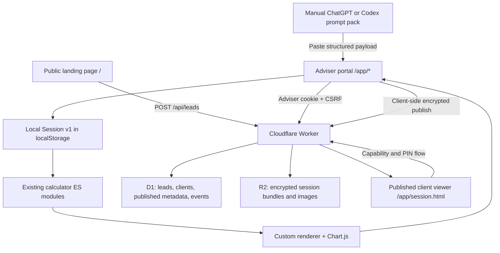
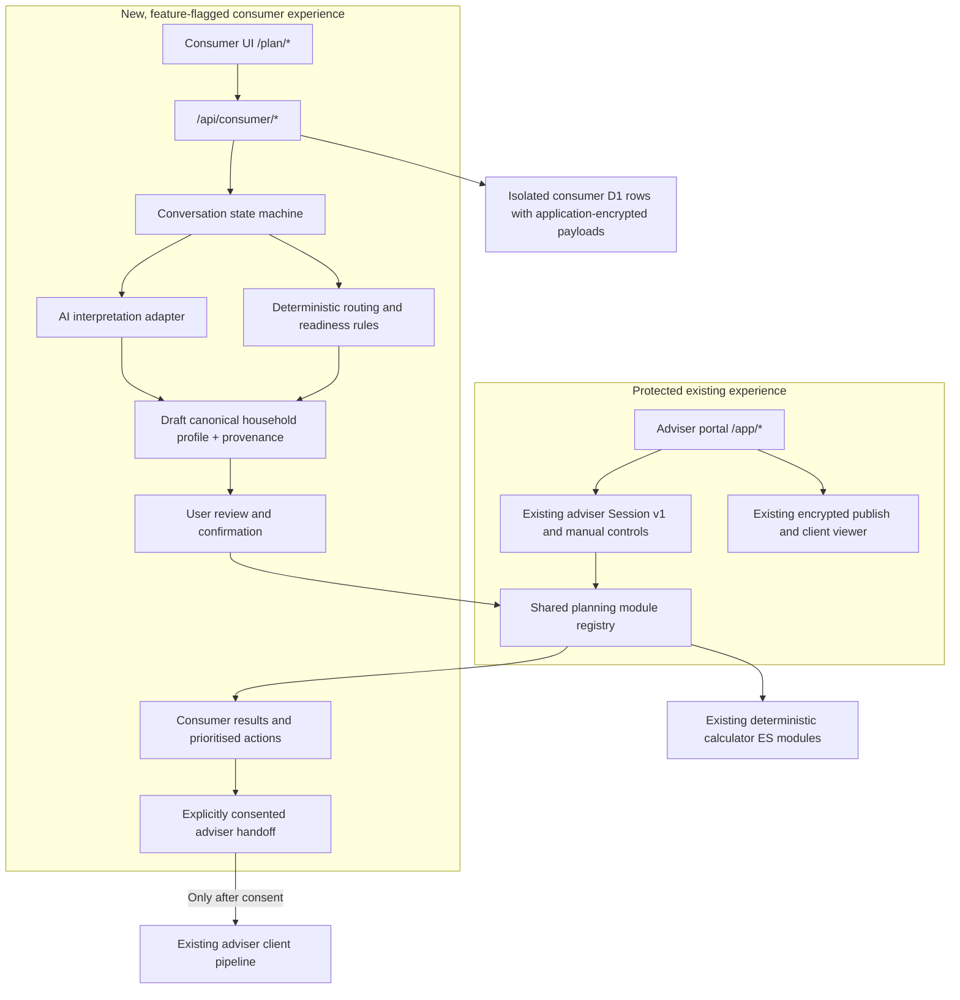

# Planéir Consumer AI Journey Integration Plan

Status: production-hardened implementation complete through the feature-flagged text,
deterministic-analysis, optional AI-intake, and Gerry-handoff private-beta seams.
Automated, fresh dual-D1, desktop/mobile browser, deletion, and existing-workflow
acceptance are complete. No production deployment, production migration, or secret change
was made. Production flags remain disabled pending the external activation gates below.

Repository baseline: `main` at `5220407` on 12 July 2026.

Release posture: Phases 0–5 are implemented and safely dormant. Phases 6–8 remain
intentional future product phases, not hidden launch dependencies for the invited text
beta. Activation still requires a distinct production `CONSUMER_DB`, protected secrets,
approved consent/privacy/AI/handoff policies, edge-enforced static response headers, and
a staged invite cohort. Until those controls are supplied, the fail-closed configuration
keeps consumer processing unavailable and `/plan/*` presents a neutral unavailable state,
while the existing `/app/*` and published-session workflow continue unchanged.

## Executive recommendation

The implementation supports the consumer journey incrementally through a limited, isolated refactor. The deterministic calculation functions for House Purchase, Pension, Net Retirement Cash Flow, Mortgage/Loan, College Funding, and the core liquidity reserve remain reusable outside the adviser UI. They are wrapped by a central registry and canonical-profile adapters rather than rewritten.

The adviser portal should remain at its current `/app/*` routes and continue using its existing local session, manual module, editing, rendering, publishing, and client-pipeline workflows. The new consumer experience should live at `/plan/*`, use a separate session/auth namespace and separate persistence tables, and reach the existing calculators through pure adapters. The first consumer release should expose only modules whose calculations are code-owned and tested.

Personal Balance Sheet is not yet fully code-owned: its classification and displayed totals currently arrive through the prompt/payload workflow. CAT, business-owner relief, and agricultural relief are not independent deterministic modules in this repository. They must remain adviser-only until their rules, dated tax inputs, outputs, and tests exist in code. Calling them consumer-ready now would create a second, AI-owned calculation path and violate the core objective.

### Implementation hardening decisions

- The first implementation uses application-encrypted payload columns in isolated
  consumer D1 tables instead of adding an R2 namespace. Keeping the index and
  ciphertext in one transactional store removes dual-write/orphan failure modes
  while the feature is dormant. Ciphertext has a strict size ceiling, AES-GCM
  additional authenticated data, a versioned key ID, a bounded previous-key read
  ring, and hard deletion/expiry coverage. Existing R2 prefixes are untouched.
- Consumer access uses a per-session opaque header credential held in
  `sessionStorage`; only its hash is stored. It is never accepted by adviser
  endpoints and does not share the adviser cookie/CSRF boundary.
- Session creation enforces analysis consent, an 18+ confirmation, an explicit
  education-not-advice acknowledgement, the current policy version, and an
  explicit AI-processing choice.
- OpenAI is limited to strict-schema draft extraction with `store: false`, bounded
  output and timeout. The default tier is `gpt-5.6-luna` at low effort; only
  materially ambiguous turns may escalate to `gpt-5.6-terra` at medium effort.
  Rules-only intake remains the no-key, outage, invalid-output, and budget fallback.
- House Purchase and Liquidity are the only initial consumer calculation modules.
  Other deterministic adapters expose readiness but stay gated; PBS and tax/relief
  composition remains adviser-only.

## 1. Current-state architecture

### Runtime and deployment

- The application is a static multi-page site made from HTML, custom CSS, and browser-native ES modules. There is no React/Vue/Svelte framework, TypeScript compiler, application bundler, or runtime schema library.
- `scripts/build-pages.mjs` copies and versions the static assets into `dist/`. GitHub Pages deploys only `dist/` through `.github/workflows/deploy-pages.yml`.
- A single Cloudflare Worker entry point, `worker/src/index.js`, provides the API. It is deployed by `.github/workflows/deploy-worker.yml`.
- Cloudflare D1 (`LEADS_DB`) stores leads, clients, published-session metadata, events, and rate limits. Cloudflare R2 (`SESSIONS_BUCKET`) stores encrypted published session bundles and module images.
- Resend handles outbound email. Zoom Server-to-Server OAuth creates and deletes scheduled calls. The Worker cron cleans up expired Zoom proposals.
- Chart.js and Sortable are vendored browser libraries. UI components are custom DOM builders in `js/render.js`; visual tokens and layout live mainly in `styles/base.css` and `styles/landing.css`.

### Current routes

| Surface | Route | Purpose | Access boundary |
|---|---|---|---|
| Public | `/` | Landing page and lead request | Public |
| Adviser workspace | `/app/` | Build, edit, reorder, compare, and publish module sessions | Adviser password session |
| Adviser pipeline | `/app/clients.html` | Leads, clients, scheduling, published links, emails | Adviser password session |
| Client viewer | `/app/session.html?id=...` | Decrypt and render a published client snapshot | Client capability plus PIN flow where applicable |
| Video composer | `/app/video.html` | Local capture composition | Opened from adviser workflow; scene is in browser session storage |
| Compatibility | `/app/access.html`, `/app/leads.html`, `/session.html` | Redirects preserving older URLs | Existing behavior retained |

The Worker route table is explicit in `getRouteConfig()` and the `fetch()` dispatcher in `worker/src/index.js`. Existing endpoint groups are:

- Public lead submission and schedule response: `/api/leads`, `/api/leads/schedule-response`.
- Adviser authentication: `/api/auth/session`, `/api/auth/login`, `/api/auth/logout`.
- Adviser client/lead management: `/api/advisor/clients*`, `/api/advisor/leads*`.
- Draft module assets: `/api/advisor/module-assets/:sessionId/:assetId`.
- Publishing, viewing, expiry, revocation, PIN, notification, and unlock telemetry under `/api/publish`, `/api/session/*`, and `/api/published-sessions/*`.

### Authentication and roles

- Adviser authentication is a single configured adviser identity, not a multi-user role system. The Worker validates a password or PBKDF2 password hash and issues an HMAC-signed, seven-day `planeir_advisor_session` HttpOnly cookie.
- State-changing adviser requests require the cookie, a trusted origin, rate-limit checks, and `X-Advisor-CSRF`.
- Published client and adviser access use separate URL-fragment secrets and derived capability tokens. Published payloads are encrypted in the browser with AES-GCM before upload; the Worker stores encrypted client and adviser bundles separately.
- There is no consumer account/session identity, household ownership model, or adviser-to-consumer access grant today.

### Persistence and state management

- The active adviser draft is a version-1 `Session` stored in browser `localStorage` under `call_canvas_session_current` by `js/state.js`.
- A session contains `clientName`, `modules`, module `order`, and `activeModuleId`. Each module contains `title`, private adviser `notes`, a polymorphic `generated` object, `media`, and UI state.
- The D1 `clients` table is a contact/pipeline record, not a financial fact-find. It stores identity/contact fields, pipeline stage, and adviser notes.
- Financial module inputs and outputs live in local or published session JSON, not in normalized D1 household tables.
- Published client snapshots intentionally omit adviser notes and most editing UI state. Adviser snapshots retain the full session. Module images are private R2 assets copied from draft to published keys.

### Validation, tests, AI, and voice

- Validation is handwritten in the calculation modules, `js/state.js`, `js/app.js`, and `worker/src/index.js`. There is no Zod/Ajv/Valibot dependency.
- Tests are custom assertion functions and Node smoke scripts rather than a formal test runner. High-value coverage exists for House Purchase, Pension, Mortgage, Net Retirement, College Funding, module media, publishing routes, video scenes, and video briefs, but not for a complete adviser end-to-end journey.
- There is no live model API integration. `docs/prompt-pack/` supports a manual ChatGPT/Codex-to-Dev-Panel JSON workflow. “Copy Call for Codex” is also a manual clipboard/download handoff and explicitly makes no AI API call.
- There is no conversational intake, speech-to-text, or text-to-speech. Camera, microphone, display capture, and `MediaRecorder` are used only in local video-production tooling.

### Current architecture map



## 2. Existing adviser workflow

The actual workflow to protect is:

1. A public lead submits the landing-page form; the Worker validates it, writes it to D1, and optionally sends email.
2. The adviser signs in and opens `/app/clients.html`, reviews the client/lead, edits contact and pipeline data, schedules a Zoom call, or starts a session.
3. “Start Session” opens `/app/index.html` with client/lead query parameters and `fresh=1`. The adviser session is still a browser-local `Session v1`; the D1 client record is not a financial profile.
4. The adviser creates blank modules. Module type is established by applying a valid structured payload, usually through the hidden Dev/Codex payload tester, or by using module-specific UI such as the House Purchase wizard.
5. The adviser can edit titles, notes, supported assumptions, generated text, module images, card order, hidden cards, scenarios, and module order. Runtime-backed modules are recalculated in the browser after supported input edits.
6. The adviser reviews modules in focused, overview, or comparison modes and can create local video scenes or a manual Codex video brief.
7. Publishing creates separate client and adviser JSON snapshots, encrypts both in the browser, uploads encrypted bundles and asset references, and links the published record to the pipeline where applicable.
8. The client opens the published viewer. It is read-only and renders the same normalized module structures without adviser controls or adviser notes.

Important correction to the product brief: the repository does not currently provide a conventional module-picker/fact-find UI for every module. The protected behavior is the existing blank-module plus structured-payload workflow, the module-specific editors that do exist, and manual adviser control over module order and content. The consumer project must not silently replace that with automatic routing.

## 3. Existing module architecture

### Session/module contract

`js/state.js` normalizes a polymorphic `generated` object. A module’s type is inferred from which generated key is populated, for example `pensionInputs`, `housePurchaseInputs`, `liquidityPlan`, `outputsBucketed`, `education`, or `report`. There is no central registry containing applicability, required inputs, readiness, dependencies, or consumer availability.

`js/app.js` owns module creation, payload validation/application, projection refresh, assumption editing, persistence, publishing, and most workflow transitions. `js/render.js` infers module kind again and owns type-specific presentation. This is functional but too coupled for consumer orchestration.

### Reuse assessment

| Planning capability | Current implementation | UI-independent calculation? | Consumer readiness now |
|---|---|---:|---|
| Personal Balance Sheet | `generated.outputsBucketed`, prompt contract, normalization and rendering | No complete deterministic classifier/calculator | Adviser-only until code-owned PBS logic exists |
| Liquidity Analysis | `js/liquidity_reserve.js`; additional assessment logic in `js/render.js` | Partly | Beta after assessment logic is extracted from renderer |
| House Purchase Planner | `js/house_purchase/*` | Yes; pure engine with rules, readiness-like outputs, tables, charts | Best first consumer module after rule-date controls |
| Pension Projection | `js/pension_math.js` | Yes | Beta; requires canonical adapter and consumer wording review |
| Retirement Goal Analysis | Pension engine and `js/net_retirement_math.js` cover different gross/net questions | Yes, but not one current module | Expose as goal routing to the correct existing engine, not a duplicate engine |
| Net Retirement Cash Flow | `js/net_retirement_math.js` | Yes | Beta with gross/net boundary safeguards |
| Mortgage Analysis | `js/mortgage_math.js` | Yes | Beta; educational illustration only |
| Loan Analysis | Same amortisation engine with `loanKind` | Yes | Initially adviser-only unless product scope includes it |
| College Funding | `js/college_funding_math.js` | Yes | Beta after progressive questions and assumptions review |
| Scenario Analysis | Scenario switches exist inside several engines | No standalone module | Treat as orchestration/composition capability, not a new calculator |
| Education / Protection / Report | `generated.education` and `generated.report`; trusted renderers | Presentation only | Not a financial calculation engine |
| CAT Analysis | Tax overlay/prompt material only | No | Adviser-only |
| Business-owner relief | No dedicated module/engine | No | Unsupported/adviser-only |
| Agricultural relief | No dedicated module/engine | No | Unsupported/adviser-only |

The pure engines return assumptions, outputs, tables/charts, and debug/semantic results. They can be imported without `js/app.js` or DOM components. The safe seam is therefore an adapter/registry around those exports. The unsafe seam is calling adviser UI helpers from the consumer journey.

### Report pipeline

There is no server-side report generator or PDF pipeline. A Report is a structured module normalized by `js/report.js` and rendered by trusted component builders in `js/render.js`. Publishing serializes the session’s modules and the client viewer renders that snapshot. The consumer result experience should reuse module result data and selected rendering primitives, but it should not equate “Report module” with an independent calculation.

## 4. Risks to current functionality

| Risk | Repository-specific exposure | Mitigation and release gate |
|---|---|---|
| Adviser regression | `app_entry.js`, `js/app.js`, `js/render.js`, `js/state.js`, and the Worker dispatcher are central, large protected surfaces | Keep `/app/*` unchanged through the first consumer phases; add adviser startup, editing, publish, decrypt, and viewer E2E tests before shared changes |
| Data migration | `clients` is a contact/pipeline table and `Session v1` is embedded in local/published JSON, not a canonical fact-find | Use additive consumer tables and adapters; never rewrite existing rows or silently migrate local/published sessions; require a compensating-migration rollback note |
| AI extraction | There is no current model API, structured-output validator, provenance store, or contradiction handler | AI returns allowlisted draft patches only; strict validation, provenance, visible review, and rules-only fallback are mandatory before AI beta |
| Privacy and isolation | Current adviser cookie, published capabilities, D1 metadata, and encrypted R2 bundles represent different trust boundaries | Create a separate consumer credential and encrypted D1 table namespace; add cross-session and cross-route authorization tests; require explicit handoff consent |
| AI cost | No current token, model, latency, or per-session budget telemetry exists | Add hard per-turn/session/day limits and degraded rules-only mode; cost dashboard and kill switch are beta gates |
| Duplicated logic | Module type/rerun logic is currently inferred in both `app.js` and `render.js`; copying it into `/plan/` would create a second engine | One DOM-free registry and adapters import the existing calculation exports; no copied formulas or handwritten duplicate registry |
| User trust | Approximate conversational values could otherwise look as authoritative as adviser-confirmed inputs | Show certainty/confidence, assumptions, missing items, module rationale, and exact review/correction before every run |
| Regulatory language | Prompt-backed education/report content and time-sensitive Irish rules could be phrased as advice, eligibility, or approval | Version disclosures and prohibited phrases; code-owned calculations only; tax/relief modules adviser-only until dated deterministic rules pass review |
| Calculation parity | Moving or wrapping engines could alter outputs, dates, rounding, rule screens, or scenario selection | Golden input/output fixtures compare direct engine calls with registry calls; block release on any unexplained delta |
| Worker blast radius | `worker/src/index.js` is a 7,000+ line route/auth/email/publish implementation | Add one narrow `/api/consumer/*` delegation; keep existing handlers unchanged; run old-route integration tests on every consumer Worker change |
| Static-host authorization | GitHub Pages cannot enforce server-side route guards | Treat page visibility as UX only; enforce ownership and permissions at every consumer API/D1 operation |
| Time-sensitive rules | House Purchase, pension, CAT, business, and agricultural inputs can become stale | Record calculation/rule version and effective date; assign an owner and expiry/refresh policy; block a stale module rather than silently use it |

## 5. Recommended target architecture

Keep `/app/*` unchanged. Add `/plan/*`; do not rename the adviser routes to `/portal/adviser/*` because existing production links and navigation already use `/app/*`.



### What remains untouched

- Existing `/app/*` and `/app/session.html` URLs and navigation.
- Adviser auth cookie, CSRF behavior, password configuration, and current endpoint semantics.
- `Session v1`, existing saved/published payload readers, client capability/PIN flow, and encrypted publish paths.
- Current adviser ability to create blank modules, paste/apply structured payloads, edit modules, rerun supported calculators, reorder modules, add images, create video aids, and publish.
- Current D1 `clients`, `leads`, `published_sessions`, and current R2 key namespaces.

### What is shared

- The existing pure calculation exports.
- A new DOM-free module registry, profile-to-engine adapters, readiness rules, calculation/rule versions, and result envelope.
- Selected display-format helpers only after they are made DOM-free; consumer UI remains separate.

### What is new

- `/plan/` UI, navigation, state machine, review screen, result summary, and handoff CTA.
- `/api/consumer/*` router with its own session authentication and authorization.
- Canonical household profile, field provenance, profile revisions, consumer session state, module recommendation/audit records, and handoff package.
- AI provider adapter for extraction/conversation only.
- Server-side feature flags, kill switch, consumer telemetry, retention/deletion jobs, and cost limits.

### Required adapters

- Adviser `Session v1` module inputs -> canonical profile fragments, only when an adviser explicitly chooses to import or inspect a handoff.
- Canonical profile -> each existing calculator’s current input schema.
- Existing calculator result -> common `ModuleRunResult` -> consumer result cards.
- Confirmed consumer handoff -> existing client pipeline contact record plus a separate handoff link; never silently write unconfirmed profile data into `clients`.

## 6. Data-model changes

Use a canonical profile with normal domain values plus JSON-pointer field metadata. Wrapping every primitive in `{ value, provenance }` would make current calculator adapters unnecessarily invasive. A separate `fieldMetadata` map preserves uncertainty and provenance without changing calculator input shapes.

```ts
type ISODateTime = string;
type CurrencyCode = "EUR" | "GBP" | "USD";
type FieldPath = string; // JSON Pointer, e.g. /assets/0/currentValue

type ValueCertainty =
  | "exact"
  | "approximate"
  | "range"
  | "unknown"
  | "inferred";

interface FieldProvenance {
  source:
    | "user_statement"
    | "user_confirmation"
    | "adviser_entry"
    | "calculated"
    | "imported";
  confidence: "high" | "medium" | "low";
  certainty: ValueCertainty;
  capturedAt: ISODateTime;
  conversationTurnId?: string;
  confirmedByUser: boolean;
  range?: { min: number; max: number };
  note?: string;
}

interface MoneyValue {
  amount: number;
  currency: CurrencyCode;
}

interface PersonProfile {
  personId: string;
  role: "primary" | "partner";
  displayName?: string;
  dateOfBirth?: string;
  age?: number;
  employmentStatus?: "employee" | "self_employed" | "contractor" | "retired" | "other" | "unknown";
  intendedRetirementAge?: number;
}

interface DependantProfile {
  dependantId: string;
  displayName?: string;
  currentAge?: number;
  expectedDependencyEndAge?: number;
}

interface Asset {
  assetId: string;
  ownerIds: string[];
  type: "cash" | "investment" | "property" | "pension" | "business" | "agricultural" | "other";
  label: string;
  currentValue?: MoneyValue;
  liquid?: boolean;
}

interface Liability {
  liabilityId: string;
  ownerIds: string[];
  type: "mortgage" | "loan" | "credit_card" | "other";
  label: string;
  currentBalance?: MoneyValue;
  annualInterestRate?: number; // decimal, not percentage points
  monthlyPayment?: MoneyValue;
  remainingTermMonths?: number;
}

interface IncomeSource {
  incomeId: string;
  ownerId: string | "household";
  type: "employment" | "self_employment" | "rental" | "pension" | "state_pension" | "other";
  label: string;
  grossAnnual?: MoneyValue;
  netAnnual?: MoneyValue;
  startAge?: number;
  endAge?: number;
  inflationIndexed?: boolean;
}

interface ExpenseProfile {
  annualTotal?: MoneyValue;
  monthlyEssential?: MoneyValue;
  monthlyDiscretionary?: MoneyValue;
  currentMonthlyRent?: MoneyValue;
}

interface PensionProfile {
  pensionId: string;
  ownerId: string;
  type: "occupational" | "prsa" | "personal" | "defined_benefit" | "other";
  currentValue?: MoneyValue;
  employeeContributionRate?: number;
  employerContributionRate?: number;
  projectedAnnualIncome?: MoneyValue;
}

interface PropertyProfile {
  propertyId: string;
  ownerIds: string[];
  use: "home" | "rental" | "farm" | "business" | "other";
  currentValue?: MoneyValue;
  associatedLiabilityIds: string[];
}

interface BusinessInterest {
  businessId: string;
  ownerIds: string[];
  label: string;
  estimatedValue?: MoneyValue;
  agricultural: boolean;
}

interface PlanningPreferences {
  baseCurrency: CurrencyCode;
  riskDiscussionCompleted: boolean;
  preferredContactMethod?: "email" | "phone";
}

interface AnalysisAssumptions {
  inflationRate?: number;
  investmentGrowthRate?: number;
  calculationDateIso: string;
  values: Record<string, unknown>;
}

interface MissingInformationItem {
  fieldPath: FieldPath;
  reason: string;
  blockingModuleIds: string[];
  importance: "required" | "recommended" | "optional";
}

interface ConsentRecord {
  consentId: string;
  purpose: "analysis" | "ai_processing" | "save_profile" | "adviser_handoff" | "marketing";
  granted: boolean;
  policyVersion: string;
  capturedAt: ISODateTime;
  withdrawnAt?: ISODateTime;
}

interface HouseholdProfile {
  profileId: string;
  schemaVersion: number;
  revision: number;
  source: "adviser" | "consumer";
  primaryPerson: PersonProfile;
  partner?: PersonProfile;
  dependants: DependantProfile[];
  assets: Asset[];
  liabilities: Liability[];
  incomeSources: IncomeSource[];
  expenses: ExpenseProfile;
  pensions: PensionProfile[];
  properties: PropertyProfile[];
  businesses: BusinessInterest[];
  goals: FinancialGoal[];
  preferences: PlanningPreferences;
  assumptions: AnalysisAssumptions;
  fieldMetadata: Record<FieldPath, FieldProvenance>;
  missingInformation: MissingInformationItem[];
  consent: ConsentRecord[];
  confirmedAt?: ISODateTime;
  createdAt: ISODateTime;
  updatedAt: ISODateTime;
}
```

Recommended additive storage:

- `consumer_sessions`: lifecycle, stage, hashed session credential, feature cohort, current profile revision, timestamps, expiry, deletion marker.
- `consumer_profile_revisions`: encrypted profile payload reference, revision, confirmation timestamp, schema version.
- `consumer_conversation_turns`: encrypted content reference, role, turn id, redaction status, model metadata, timestamps. Full text should have shorter retention than confirmed profile data.
- `consumer_analysis_runs` and `consumer_module_runs`: input snapshot hash, module/rule/calculation versions, readiness, status, duration, encrypted result reference.
- `consumer_events`: allowlisted event name and non-sensitive metadata.
- `consumer_handoffs`: consent id, immutable package reference, status, intended recipient, and eventual `client_id` link.

Do not add household finances as columns to `clients`. Do not migrate existing published sessions into consumer tables.

## 7. Module-registry design

Create one DOM-free registry in `js/planning/module_registry.js`. Both browser apps and, after a Wrangler import smoke test, the Worker should import it. If Wrangler cannot safely bundle modules above `worker/`, add a build-generated Worker copy; do not maintain two handwritten registries or calculation implementations.

```ts
type ModuleAvailability = "active" | "beta" | "adviser_only" | "unsupported";
type ModuleKind = "calculation" | "composition" | "presentation";

interface ModuleRunContext {
  calculationDateIso: string;
  calculationVersion: string;
  scenarioId?: string;
  signal?: AbortSignal;
}

interface ModuleRunResult {
  moduleId: string;
  moduleVersion: string;
  calculationVersion: string;
  inputSnapshotHash: string;
  assumptions: unknown;
  outputs: unknown;
  tables: unknown[];
  charts: unknown[];
  semanticResult: Record<string, unknown>;
  warnings: string[];
  calculatedAt: ISODateTime;
}

interface ModuleReadiness {
  status:
    | "ready"
    | "ready_with_assumptions"
    | "missing_information"
    | "not_relevant"
    | "adviser_review_required"
    | "unsupported";
  requiredMissing: MissingInformationItem[];
  assumptionsUsed: { key: string; value: unknown; reason: string }[];
  warnings: string[];
}

interface PlanningModuleDefinition<TInput = unknown> {
  id: string;
  kind: ModuleKind;
  name: string;
  description: string;
  status: ModuleAvailability;
  moduleVersion: string;
  applicableGoals: FinancialGoal["type"][];
  requiredProfilePaths: FieldPath[];
  optionalProfilePaths: FieldPath[];
  exclusionRuleIds: string[];
  prerequisiteModuleIds: string[];
  adviserAvailable: boolean;
  consumerAvailable: boolean;
  canRun(profile: HouseholdProfile): ModuleReadiness;
  explainSelection(profile: HouseholdProfile): string[];
  buildInput(profile: HouseholdProfile): TInput;
  run?: (input: TInput, context: ModuleRunContext) => Promise<ModuleRunResult>;
}
```

Initial registry policy:

- Consumer beta candidates: `liquidity_analysis`, `house_purchase`, `pension_projection`, `net_retirement_cashflow`, `mortgage_analysis`, and later `college_funding`.
- `retirement_goal_analysis` is a routing label that chooses pension projection, net retirement cash flow, or both; it is not a second retirement engine.
- `scenario_analysis` is a composition capability over scenario-aware modules; it does not calculate independently.
- `personal_balance_sheet` remains `adviser_only` until classification, totals, reconciliation, and scenario movements are code-owned.
- `cat_analysis`, `business_owner_relief`, and `agricultural_relief` remain `adviser_only`/`unsupported` until deterministic, date-versioned rules and tests are implemented.
- Education, Protection, and Report remain presentation definitions, not evidence that a calculation exists.

## 8. Consumer orchestration layer

The orchestration service should be deterministic around an AI-assisted intake:

1. Load the current session, profile revision, feature cohort, and conversation stage.
2. Accept one user message or one direct review edit with an idempotency key.
3. Ask the AI adapter for a structured **profile patch**, goal candidates, ambiguities, and suggested follow-up intents. The model cannot commit data.
4. Validate the patch against allowed paths, types, bounds, and current stage. Record provenance and uncertainty.
5. Apply deterministic goal/circumstance rules and registry readiness checks.
6. Choose the next question from missing inputs that materially affect likely modules.
7. At review, freeze a profile revision and require explicit confirmation.
8. Build an `AnalysisPlan`; resolve prerequisites; run modules in dependency order; record input hashes and versions.
9. Produce a deterministic result summary first. AI narrative, if enabled later, receives only confirmed inputs and code-owned results and cannot alter numbers.
10. Invalidate only affected module runs after a correction, then rerun idempotently.

```ts
interface ModuleRecommendation {
  moduleId: string;
  priority: number;
  source: "ai_suggestion" | "deterministic_rule" | "user_selected";
  status: "required" | "recommended" | "optional" | "excluded";
  rationale: string[];
  triggeredRuleIds: string[];
  readiness: ModuleReadiness;
  userDecision?: "accepted" | "removed" | "requested_explanation";
}

interface SelectedModule {
  moduleId: string;
  priority: number;
  required: boolean;
  readiness: ModuleReadiness;
  inputSnapshotHash?: string;
  runId?: string;
}

interface AnalysisPlan {
  analysisPlanId: string;
  profileId: string;
  profileRevision: number;
  selectedModules: SelectedModule[];
  recommendations: ModuleRecommendation[];
  requiredQuestions: RequiredQuestion[];
  assumptions: AnalysisAssumptions;
  rulesVersion: string;
  status: "draft" | "awaiting_confirmation" | "ready" | "running" | "complete" | "needs_review";
  createdAt: ISODateTime;
  updatedAt: ISODateTime;
}
```

## 9. AI and rules responsibilities

### AI may

- Interpret natural language, identify possible goals, extract bounded structured patches, detect contradictions/ambiguity, and phrase a relevant follow-up.
- Suggest modules and plain-language rationales.
- Summarize already-calculated results, subject to a number-preservation validator and disclosure rules.

### Deterministic code must

- Validate every patch and value; own all calculations, tax/rule inputs, mandatory routing, exclusions, prerequisites, readiness, and missing-field detection.
- Log AI suggestion versus rule override separately.
- Refuse unsupported module runs and regulated/approval language.
- Continue in rules-only mode if the AI provider fails.

### Cost controls

- Use structured outputs and a small extraction/classification model by default.
- Send only the active stage summary, relevant profile slice, and likely module field requirements—not the full database row or full lifetime transcript.
- Maintain a short rolling summary and fetch only relevant registry definitions.
- Enforce per-turn, per-session, and daily token/cost limits; record model, tokens, latency, and cached status.
- Use a larger model only for explicitly identified complex ambiguity or optional post-calculation narrative.
- Never spend model tokens on calculation.

## 10. Conversation design

```ts
type ConversationStage =
  | "consent"
  | "goal_discovery"
  | "household"
  | "income"
  | "assets"
  | "liabilities"
  | "expenses"
  | "goal_specific_questions"
  | "review"
  | "module_recommendation"
  | "missing_information"
  | "analysis"
  | "results"
  | "human_handoff";

interface RequiredQuestion {
  questionId: string;
  fieldPaths: FieldPath[];
  reason: string;
  blockingModuleIds: string[];
  prompt: string;
  answerType: "text" | "money" | "number" | "date" | "choice" | "boolean";
  optional: boolean;
}

interface ConsumerSession {
  sessionId: string;
  schemaVersion: number;
  status: "active" | "completed" | "abandoned" | "deleted" | "expired";
  stage: ConversationStage;
  profileId: string;
  currentProfileRevision: number;
  confirmedProfileRevision?: number;
  candidateGoalIds: string[];
  activeQuestionId?: string;
  analysisPlanId?: string;
  featureCohort: string;
  rollingSummary?: string;
  createdAt: ISODateTime;
  lastActiveAt: ISODateTime;
  expiresAt: ISODateTime;
}
```

Stage transitions are allowlisted. A model may recommend a transition, but code checks exit criteria. The question selector ranks fields by: blocks a required module, affects more than one likely module, materially changes output, then user effort. It must not ask retirement, CAT, business, or agricultural questions when the user is only exploring a first home unless an answer makes those topics directly relevant.

## 11. Voice-readiness design

Keep the first release text-only. Define transport-neutral interfaces now:

- `InputTransport`: typed text or final speech transcript -> the same `/turns` request.
- `SpeechToTextAdapter`: audio -> transcript plus confidence and timestamps.
- `ConversationOrchestrator`: transcript/text -> structured patch, next action, response text.
- `TextToSpeechAdapter`: response text -> optional audio.

Do not place microphone permissions, streaming audio state, or provider-specific events inside the financial state machine. Do not reuse the video recorder as intake voice infrastructure. Voice must be individually feature-flagged, require explicit microphone consent, show a transcript before confirmation, and fall back to text without losing state.

## 12. User confirmation and correction flow

- Extraction writes only to a draft profile revision.
- The review screen groups household, goals, income, assets, liabilities, pensions, expenses, assumptions, approximate/range values, missing items, and proposed modules.
- Approximate, inferred, low-confidence, and unknown fields have visible badges and “why we think this” detail.
- Direct edits create a new revision with `user_confirmation` provenance for changed fields.
- “That is not right” opens the relevant group, preserves the prior revision in the audit trail, and records a correction event without storing sensitive content in general logs.
- Confirmation freezes the exact revision used by the analysis plan. Later edits create a new revision and invalidate runs whose adapter dependency paths intersect the changed paths.
- Persistent/saved status is separate from confirmation. A user may confirm values for one analysis without consenting to long-term retention or adviser sharing.

## 13. Adviser handoff

```ts
interface AdviserHandoffPackage {
  handoffId: string;
  consumerSessionId: string;
  profileId: string;
  confirmedProfileRevision: number;
  goals: FinancialGoal[];
  selectedModules: SelectedModule[];
  moduleResults: {
    moduleId: string;
    runId: string;
    inputSnapshotHash: string;
    moduleVersion: string;
    calculationVersion: string;
  }[];
  userQuestions: string[];
  uncertaintyFlags: MissingInformationItem[];
  conversationSummary: string;
  requestedHelp: string;
  intendedRecipient: { type: "gerry" | "adviser"; adviserId?: string; displayName: string };
  consent: ConsentRecord;
  disclosureVersion: string;
  sharedFieldPaths: FieldPath[];
  createdAt: ISODateTime;
  revokedAt?: ISODateTime;
}

interface FinancialGoal {
  goalId: string;
  type:
    | "understand_position"
    | "maintain_liquidity"
    | "buy_home"
    | "build_wealth"
    | "improve_pension"
    | "retire"
    | "retire_early"
    | "optimise_mortgage"
    | "assess_decision"
    | "transfer_wealth"
    | "business_planning"
    | "agricultural_planning";
  title: string;
  targetDate?: string;
  targetAmount?: MoneyValue;
  priority: "high" | "medium" | "low";
  status: "exploring" | "active" | "completed" | "paused";
}
```

For the initial Gerry handoff:

1. Show the named recipient, purpose, exact data groups, commercial disclosure, and that declining does not remove the free analysis.
2. Capture a separate, versioned `adviser_handoff` consent.
3. Create an immutable handoff package. Only then create/link a minimal pipeline client and a handoff reference.
4. Add an adviser-only handoff section to the pipeline in a later phase; do not inject unconfirmed consumer profile fields into the existing session automatically.
5. When Gerry opens it, label the data “consumer supplied and confirmed” and retain uncertainty badges. An adviser import action can explicitly generate current module inputs and rerun the same engines.

Future matching must use transparent eligibility filters and explicit user choice. No bidding, automatic disclosure, or silent recipient change.

## 14. Privacy and data isolation

- Use a separate consumer session credential in `X-Consumer-Session`. Never accept adviser cookies as consumer identity or consumer credentials on `/api/advisor/*`.
- Keep the opaque credential in `sessionStorage` only and scope it to one browser tab. Never place it in a URL, cookie, `localStorage`, analytics payload, or handoff package. A same-site API host such as `api.planeir.ie` remains the preferred deployment shape.
- Authorize every consumer object by `consumer_session_id`; use random opaque identifiers and store only credential hashes.
- Full conversation/profile/result payloads are now application-encrypted in isolated D1 ciphertext columns; only indexes, versions, statuses, hashes, usage, consent, and allowlisted audit metadata remain plaintext. Ciphertext bounds, versioned key rotation, and complete deletion are enforced in the implementation and release checks.
- Separate full transcript retention from confirmed profile retention. Proposed defaults for product/legal review: abandoned transcript 30 days, active saved profile 12 months since last activity, audit metadata longer only where justified, immediate soft lock and queued hard deletion on request.
- Do not collect PPS numbers, account credentials, full account numbers, identification documents, or unnecessary exact addresses.
- Send only the minimum stage-specific profile slice to the AI provider. Contractually disable provider training/retention where available and record provider/model/policy version.
- CSP for `/plan/` should allow only the required API and eventual voice origins. Do not relax `app/index.html` CSP globally.
- Handoff consent is purpose-specific, revocable until delivery, and records the exact shared field paths and recipient.
- Cross-client leakage tests are mandatory at route, credential, query, ciphertext-AAD, cache, and model-context layers.

## 15. Feature-flag and rollout strategy

Server-owned flags:

```ts
interface ConsumerFeatureFlags {
  consumerJourneyEnabled: boolean;
  consumerAiIntakeEnabled: boolean;
  consumerModuleRoutingEnabled: boolean;
  consumerVoiceEnabled: boolean;
  consumerHumanHandoffEnabled: boolean;
  consumerPublicAccessEnabled: boolean;
  consumerAllowedModuleIds: string[];
  cohort: "internal" | "adviser_test" | "invited_beta" | "limited_public" | "general";
}
```

- `/api/consumer/bootstrap` returns only public evaluated flags, disclosure versions, limits, and allowed modules.
- `consumerJourneyEnabled=false` makes `/plan/` show a neutral unavailable page and makes all mutation endpoints return 404/503. It must not affect `/app/*` or any current Worker endpoint.
- AI-off routes fall back to structured/rules-only questions. Module-routing off allows intake/review but no run. Handoff off hides and rejects the CTA. Voice is independently off by default.
- Public access is independently false by default. New-session creation then requires the private invite capability; the cohort label is metadata, not access control.
- Rollout: local development -> Gerry/adviser test account -> invited beta -> limited public -> general availability.
- Roll back by flags first; schema additions and static files may remain dormant.

The earlier engineering hold on remote enablement is satisfied: mid-session AI
consent withdrawal, linked-package retention/purge, and signed expiring invites
are implemented. Production activation remains held only on the external gates
listed at the top of this plan: isolated production D1 provisioning, protected
secrets, approved policy text and durations, edge-enforced headers, and a staged
invite cohort. Public access remains a separate later release.

## 16. Migration plan

1. Add regression fixtures/tests before shared code changes.
2. Add the registry and adapters alongside current code; do not change `Session v1`.
3. Import current engines from the registry without moving their source files. Verify both browser and Wrangler builds. If Worker cross-directory imports fail, introduce one generated build artifact rather than source duplication.
4. Add consumer D1 tables through new forward-only additive migrations. Do not alter existing table constraints or rewrite production rows.
5. Add application-encrypted consumer payload columns and retention/deletion helpers in isolated D1 tables. Existing published R2 prefixes remain unchanged.
6. Add `/plan/` and `/api/consumer/*` behind disabled flags.
7. Add an explicit adviser handoff viewer only after the consumer flow and consent model are stable.

Every migration needs a down/rollback note even though D1 production migrations are forward applied. Rollback means disabling flags and deploying a compensating migration; never manually delete or mutate existing production rows. No existing saved analysis is silently migrated.

## 17. Testing plan

### Test infrastructure

- Adopt Node’s built-in `node:test` for pure units to minimize dependencies.
- Add Worker integration tests using a local Wrangler/Miniflare-compatible environment and local D1 binding.
- Add Playwright for a small set of high-value browser journeys. It is justified because current custom smoke scripts do not cover auth, route isolation, correction, or UI state end to end.
- Keep existing scripts and browser hooks until replacements prove parity.

### Adviser regression coverage

- Adviser auth success/failure, cookie expiry, CSRF rejection, and logout.
- Open `/app/`, start a fresh client-linked session, create a module, apply each supported payload, edit assumptions/text, rerun, reorder, add/remove media, save/reload local draft.
- Golden calculation parity for Pension, Net Retirement, Mortgage/Loan, College Funding, House Purchase, Liquidity, and PBS normalization/rendering.
- Publish with and without pipeline linkage; decrypt client and adviser bundles; verify adviser notes are absent from client snapshot; load existing `Session v1` fixtures.
- Existing client pipeline list/detail/scheduling and published-link actions.
- Existing client viewer permissions, PIN setup/reset, expiry, revoke, and asset access.
- Build/versioned assets and compatibility URLs.

### Consumer unit coverage

- Canonical profile validation and JSON-pointer provenance.
- Every profile-to-module adapter and readiness state.
- Routing rules, mandatory overrides, exclusions, prerequisites, deterministic ordering, and rules-only fallback.
- State-machine allowed/forbidden transitions and question prioritization.
- Profile correction dependency invalidation and idempotent reruns.
- Result number preservation and disclosure insertion.

### Consumer integration/E2E coverage

- Natural goal -> structured draft -> uncertainty marker -> relevant follow-ups -> review -> correction -> confirmation -> recommendation -> shared-engine run -> results.
- First-home and retirement golden journeys that skip irrelevant question groups.
- Resume abandoned partial session; delete session; expired credential; repeated idempotency key.
- Handoff package contains only selected/consented paths and appears only to the intended adviser boundary.
- `/api/consumer/*` cannot call `/api/advisor/*`; one consumer session cannot read another; published client capability cannot edit consumer data.

### Failure coverage

- AI timeout, rate limit, unavailable provider, invalid JSON, extra fields, prompt injection, contradiction, and low confidence.
- Missing inputs, unsupported module, stale rule version, engine exception, partial multi-module failure, duplicate request, and feature flag disabled mid-session.
- D1/encryption/provider/pipeline failure, cost limit exceeded, session expiry, retention deletion, and handoff consent withdrawal.
- Consumer result summary never uses model-invented numbers and never converts education into regulated advice or approval language.

## 18. Observability and auditability

Use a correlation id spanning the browser request, Worker turn, profile revision, analysis plan, and module runs. Record structured events without raw sensitive values:

- Conversation stage transitions and question ids.
- Changed field paths, provenance category, confidence, and confirmation—not the values in general logs.
- AI provider/model, schema version, tokens, cost, latency, cache, and failure category.
- Module recommendations, AI rationale reference, deterministic rule ids, overrides, user decisions, readiness, and missing paths.
- Module/rule/calculation versions, input snapshot hash, run status, duration, and result reference.
- Consent version, handoff recipient, shared field paths, delivery/revocation status.
- Deletion/retention actions and unauthorized-access attempts.

Analytics events should include the requested funnel:

`consumer_journey_started`, `goal_identified`, `profile_section_completed`, `profile_confirmed`, `module_recommended`, `module_removed`, `module_run`, `analysis_completed`, `scenario_run`, `handoff_viewed`, `handoff_requested`, `consultation_booked`, `consultation_paid`, and `journey_abandoned`.

The primary dashboard is started -> confirmed -> analysis completed -> help requested -> booked -> paid, segmented by cohort and module. Chat turns are a diagnostic metric, not the success metric.

## 19. Proposed file changes

| File/path | Action | Purpose and dependencies | Migration risk |
|---|---|---|---|
| `docs/consumer-ai-journey-integration-plan.md` | Create now | This plan | None |
| `app/index.html`, `app/clients.html`, `app/session.html`, `app/video.html` | Leave unchanged through Phases 0-4 | Protected adviser/client surfaces | High if changed; avoid |
| `js/app_entry.js`, `js/state.js` | Leave unchanged initially | Preserve auth startup and `Session v1` | High |
| `js/app.js`, `js/render.js` | Regression tests first; only targeted later imports/extraction | Preserve adviser workflow; extract liquidity assessment only when tested | High |
| `js/pension_math.js`, `js/net_retirement_math.js`, `js/college_funding_math.js`, `js/mortgage_math.js`, `js/house_purchase/*` | Reuse unchanged through registry | Shared deterministic engines | Medium; parity-test every wrapper |
| `js/liquidity_reserve.js` | Modify in Phase 1 | Move DOM-free liquidity assessment here from renderer | Medium |
| `js/planning/contracts.js` | Create | JSDoc/runtime constants mirroring proposed TS contracts | Low |
| `js/planning/module_registry.js` | Create | Single module metadata/run registry; imports existing engines | Medium |
| `js/planning/profile.js` | Create | Canonical profile validation, revisions, field metadata | Medium |
| `js/planning/adapters/*.js` | Create | One canonical-profile adapter per existing engine | Medium |
| `js/planning/routing_rules.js` | Create | Deterministic goal/circumstance rules and versions | Medium |
| `js/planning/analysis_orchestrator.js` | Create | Readiness, dependency order, idempotent runs, result envelopes | Medium |
| `js/planning/result_summary.js` | Create | Deterministic prioritised consumer summary | Low |
| `plan/index.html` | Create | Separate consumer shell and CSP | Low while flagged off |
| `styles/plan.css` | Create | Consumer-specific design using existing brand tokens | Low |
| `js/plan/app.js`, `api.js`, `store.js`, `state_machine.js` | Create | Consumer UI, transport, local transient state, stage transitions | Medium |
| `js/plan/components/*.js` | Create | Conversation, review, recommendation, result, consent UI | Low/medium |
| `scripts/build-pages.mjs` | Modify | Emit `/plan/index.html`; include it in version checks | Low with build snapshot test |
| `package.json` | Modify | Add planning unit/integration/E2E scripts | Low |
| `worker/src/index.js` | Targeted modify | Delegate `/api/consumer/*` and add route config only; existing handlers unchanged | High; integration-test all old routes |
| `worker/src/consumer/router.js` | Create | Consumer endpoint dispatch and method policy | Medium |
| `worker/src/consumer/session_auth.js` | Create | Separate consumer cookie/credential and ownership checks | High security sensitivity |
| `worker/src/consumer/repository.js` | Create | Encrypted D1 persistence, revisions, retention, deletion | High data sensitivity |
| `worker/src/consumer/conversation.js` | Create | State-machine service and question selection | Medium |
| `worker/src/consumer/ai_provider.js` | Create | Provider-neutral structured extraction adapter | High trust/cost sensitivity |
| `worker/src/consumer/validators.js` | Create | Strict request/model-output validation | High |
| `worker/src/consumer/handoff.js` | Create | Consent/package creation and pipeline link | High privacy sensitivity |
| `worker/consumer-migrations/0001_create_consumer_journey.sql` | Create | Add isolated consumer tables/indexes in separate `CONSUMER_DB` | Medium; additive only |
| `worker/migrations/0014_create_consumer_handoff_deliveries.sql` | Create | Add only the idempotent adviser-delivery receipt in `LEADS_DB` | Low; additive only |
| `worker/wrangler.toml` | Modify | Non-secret disabled flags and bindings only | Low; secrets stay out of git |
| `tests/planning/*`, `tests/worker/*`, `tests/e2e/*` | Create | Formal unit, integration, and E2E regression suites | Low |
| `README.md` | Modify after Phase 3 | Document local consumer development and safe flags | Low |

## 20. Phased implementation order

### Phase 0 — Regression baseline and deployment seams — implemented

- Objective: protect adviser startup, module parity, publishing, and client viewing; verify Wrangler can import the existing pure engines.
- Files: tests and scripts only, plus optional test configuration.
- Tests: adviser golden flows, engine golden fixtures, current route/auth/publish smoke tests.
- Complete when: current behavior is reproducible in CI and a Worker import proof runs without moving calculator source.
- Rollback: remove test-only files; no production behavior changed.

### Phase 1 — Shared registry and readiness — implemented

- Objective: add registry, version metadata, profile dependency paths, and adapters; extract liquidity assessment from renderer.
- Files: `js/planning/*`, `js/liquidity_reserve.js`, targeted `js/render.js` import.
- Tests: adapter inputs equal existing accepted schemas; registry results equal direct engine calls; adviser liquidity render parity.
- Complete when: all consumer-candidate modules have explicit readiness and no adviser UX change.
- Rollback: revert registry/extraction; existing direct engine calls remain available.

### Phase 2 — Canonical profile, isolated persistence, and rules — implemented

- Objective: profile revisions/provenance, consumer session auth, application-encrypted D1 storage, deterministic routing, feature bootstrap.
- Files: migration, `worker/src/consumer/*`, `worker/src/index.js`, `worker/wrangler.toml`.
- Tests: ownership isolation, encryption/deletion, rules, idempotency, flags, old endpoint regression.
- Complete when: API can create/resume/delete a flagged-off rules-only session without touching existing adviser/client records or R2 keys.
- Rollback: disable flags; deploy prior Worker; preserve additive dormant tables.

### Phase 3 — Rules-only text prototype — implemented

- Objective: `/plan/`, guided goal-specific questions, review/correction, recommendations, shared-engine analyses; no AI dependency.
- Files: `plan/*`, `js/plan/*`, build script, result components.
- Tests: first-home and retirement E2E; irrelevant-question skipping; correction/rerun; adviser URLs unaffected.
- Complete when: internal users finish two golden journeys and results match direct engine fixtures.
- Rollback: `consumerJourneyEnabled=false`; `/app/*` remains live.

### Phase 4 — AI-assisted intake — implemented, disabled until policy approval

- Objective: natural-language extraction, ambiguity detection, dynamic phrasing, strict patches, cost controls, rules-only degradation.
- Files: AI provider/validators/conversation service and plan UI status states.
- Tests: malformed output, injection, contradiction, unavailable AI, number preservation, cost limits.
- Complete when: every AI patch is schema validated, review remains mandatory, and rules-only completion still works.
- Rollback: `consumerAiIntakeEnabled=false`.

### Phase 5 — Consumer results and Gerry handoff — implemented, feature-flagged

- Objective: concise prioritised results, explicit shared-data consent, immutable package, Gerry pipeline view, booking/payment link integration chosen separately.
- Files: result/handoff components, Worker handoff service, targeted adviser pipeline addition after tests.
- Tests: consent scope, intended recipient, revocation, minimal `clients` link, no unconsented visibility.
- Complete when: invited user can receive free results and optionally send a reviewed package to Gerry with a complete audit record.
- Rollback: `consumerHumanHandoffEnabled=false`; existing packages remain locked/auditable.

### Phase 6 — Scenario follow-ups — deferred

- Objective: map “what if” requests to allowlisted parameter changes and rerun scenario-aware engines.
- Files: scenario intent rules, adapter patches, scenario UI.
- Tests: save-more, retire-later, cheaper-house examples; reject arbitrary calculator changes.
- Complete when: every answer identifies changed inputs and engine version and preserves the baseline run.
- Rollback: disable scenario action while retaining base results.

### Phase 7 — Voice — deferred

- Objective: STT/TTS adapters over the same turn API, transcript review, text fallback.
- Files: voice adapters and UI only; no financial state-machine fork.
- Tests: permission denial, partial/final transcript, correction, noisy confidence, provider outage, accessibility.
- Complete when: voice and text create identical validated turn payloads.
- Rollback: `consumerVoiceEnabled=false`.

### Phase 8 — Adviser network — deferred

- Objective: adviser identities, permissions, matching, capacity, commercial disclosures, and accepted handoff workflow.
- Prerequisite: a real multi-adviser identity/role system; the current single adviser password is insufficient.
- Complete when: access is recipient-specific, consented, transparent, revocable, and audited.
- Rollback: route all new handoffs to Gerry or disable matching; never broaden existing access.

## 21. Remaining activation and expansion decisions

The implementation has settled the first-beta architecture: invite-only guest sessions,
Worker-authoritative runs, House Purchase plus Liquidity, and handoff only to Gerry. The
remaining decisions are external activation controls or later-scope choices:

1. Can the Worker be exposed at a same-site custom domain before beta, or will the approved cross-origin deployment remain on `workers.dev`?
2. Who owns the refresh cadence and approval record for dated Irish mortgage, scheme, pension, tax, and relief rules?
3. Which OpenAI account region, retention/data-control configuration, and processing terms are approved before the optional AI flag may be enabled?
4. Which consent manifest, privacy notice, educational wording, retention periods, and handoff policy have legal/privacy approval for the production cohort?
5. Which Cloudflare edge rule will enforce CSP, `frame-ancestors`, HSTS, permissions policy, referrer policy, and content-type protections on static `/plan/*` responses?
6. Which additional code-owned modules, if any, should follow House Purchase and Liquidity after separate wording and calculation approval?
7. Do scenario follow-ups, voice, or a paid booking flow belong in the next release? They are not dependencies of the invited text beta.
8. Should a future Gerry handoff import into an editable adviser `Session v1`, or should the adviser continue to rerun modules from the minimal lead and consent receipt?

## 22. Things that must not be changed

- Do not replace, rename, or redirect the current `/app/*` adviser workflow.
- Do not force adviser-created clients or sessions through `/plan/*`.
- Do not replace manual adviser module creation/selection with AI routing.
- Do not remove or weaken adviser authentication, CSRF, trusted-origin, rate-limit, capability, PIN, expiry, revocation, or encrypted publishing controls.
- Do not change `Session v1`, existing generated field names, published payload versions, R2 keys, or D1 rows without compatibility readers, additive migration, regression fixtures, and rollback.
- Do not expose adviser notes, edit controls, draft assets, client lists, recovery secrets, or adviser links to consumers.
- Do not make consumer sessions valid on `/api/advisor/*` or published client capabilities valid on `/api/consumer/*`.
- Do not write unconfirmed conversational extractions into permanent trusted records.
- Do not create a second copy of the calculation logic or allow AI to calculate core financial outputs, thresholds, reliefs, eligibility, or approval.
- Do not call PBS, CAT, business-owner relief, or agricultural relief consumer-ready until code-owned rules and tests exist.
- Do not silently migrate production data, existing local drafts, or published sessions.
- Do not loosen the adviser CSP or client-viewer read-only boundary for consumer features.
- Do not build voice, adviser matching, bank aggregation, or regulated recommendation automation before the text and rules-only journey is reliable.
- Do not run production smoke flows that create/revoke real sessions when local/staging equivalents are available.

## Final recommendation

Proceed incrementally with a limited shared-core refactor, not a rewrite. The first implementation milestone should be regression protection plus a DOM-free registry/adapters around the existing deterministic engines. The first usable consumer milestone should be a feature-flagged, rules-only `/plan/` journey using House Purchase and Liquidity, with review and confirmation before any calculation. AI should be layered on only after that path works end to end.

This sequence gives Planéir one calculation source, two presentation/orchestration layers, isolated permissions and data, and a kill switch that leaves the production adviser portal fully operational.
